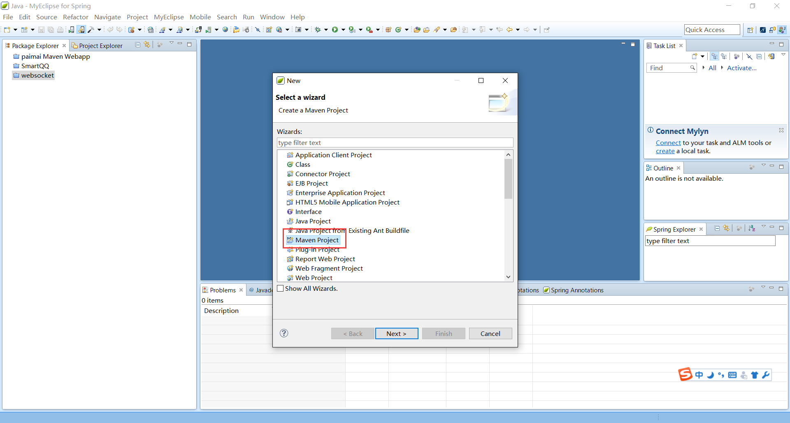
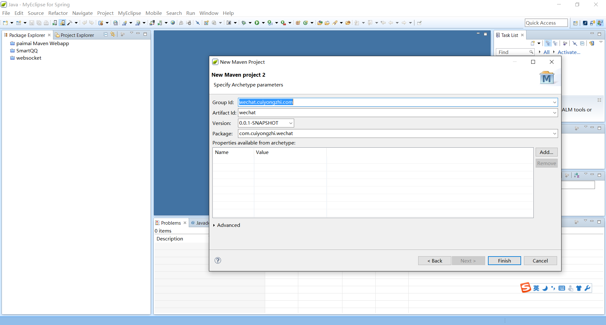
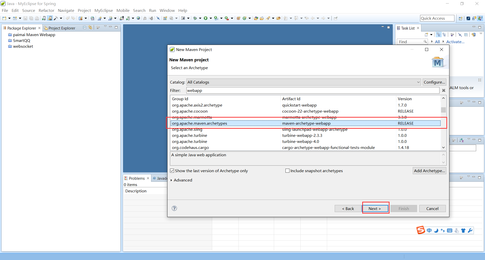
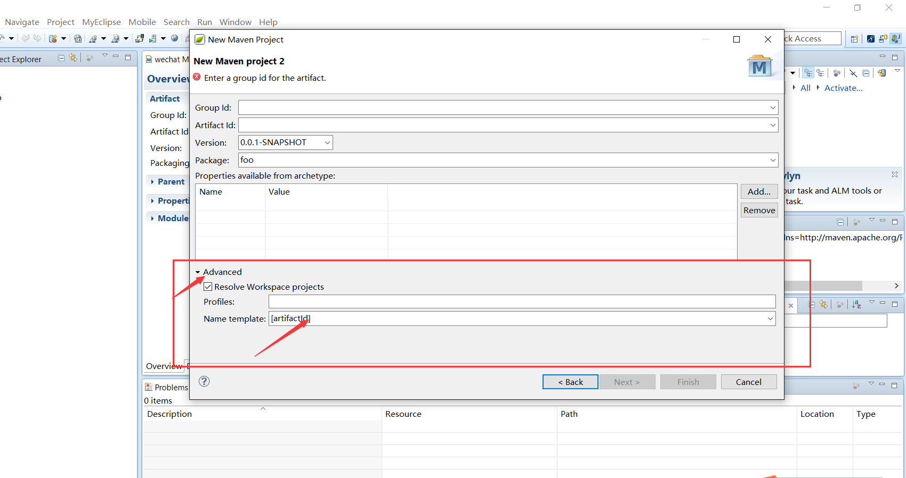
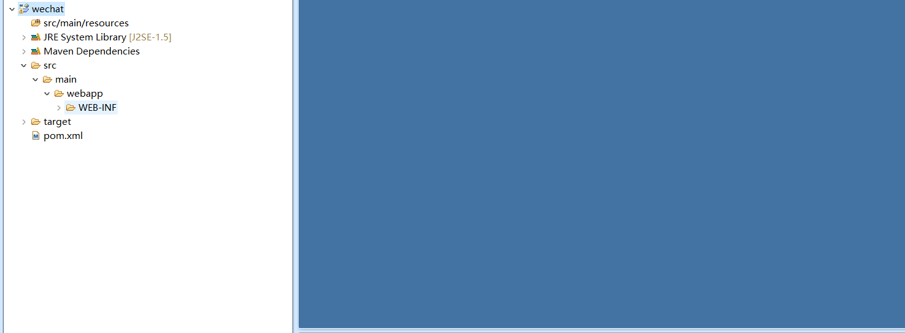
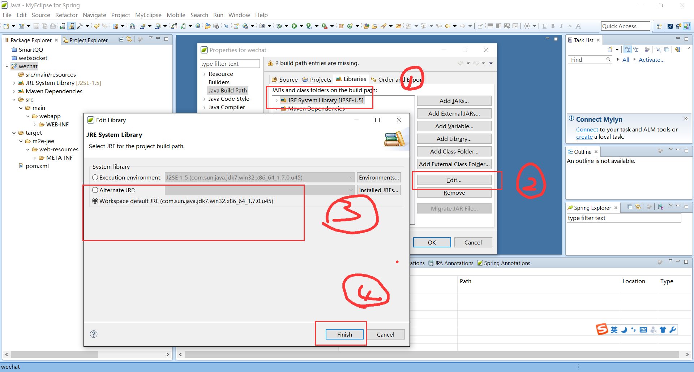
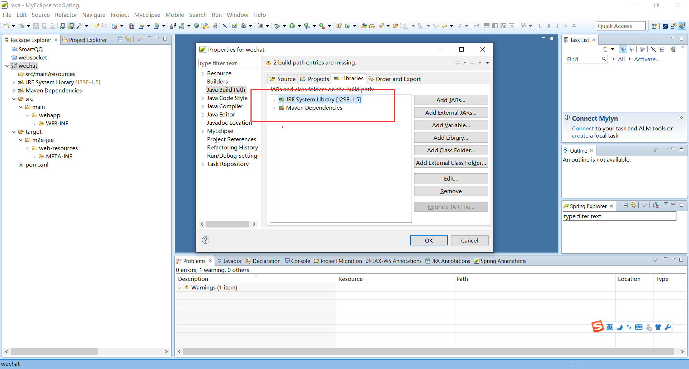
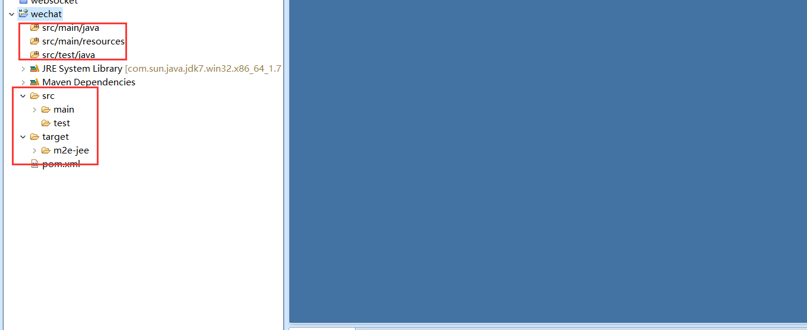

# 微信开发准备(一)--Maven 仓库管理新建 WEB 项目

在我们的项目开发中经常会遇到项目周期很长，项目依赖 jar 包特别多的情况，所以我们经常会在项目中引入 Maven 插件，建立起 Maven 项目，今天我就记录一个简单的 Maven 项目建立的简单流程！

1.Maven 基础项目的建立（前提：你的开发工具中已经集成 Maven 插件）

新建项目——>建立 Maven 项目——>选择依赖——>项目名称等即可，大致流程如下：

这里要注意的是【第三张图片】和【第四张图片】，第四张图片增加一个选项可以将项目名称做到简单修改，参考图【第五张图片】，对项目名称有严格要求的可以作此参考！

2.Maven 项目配置

可能有人会问前面已经建立了 Maven 项目，为啥还会有 Maven 项目配置这一项，我想当问这个问题的人建立过项目并且打开项目目录的时候就明白这一步的重要意义了，先来看看我们新建的项目的目录结构如下：

这个和我们平时开发中看到的项目目录结构完全不是一个样啊，难道是我们的 Maven 项目建立错了么，毫无疑问我们的项目建立是没有错的，下面我们来进行项目配置，达到我们想要的目录结构：

项目右键——>Build Path——>Libraries 修改 Jar 依赖版本，大致流程如下图：

到这里 Maven 的项目结构已经是我们需要的目录结构了，我们就可以将它纳入开发过程中了！在这过程中如有问题可以留言一起交流，谢谢翻阅！