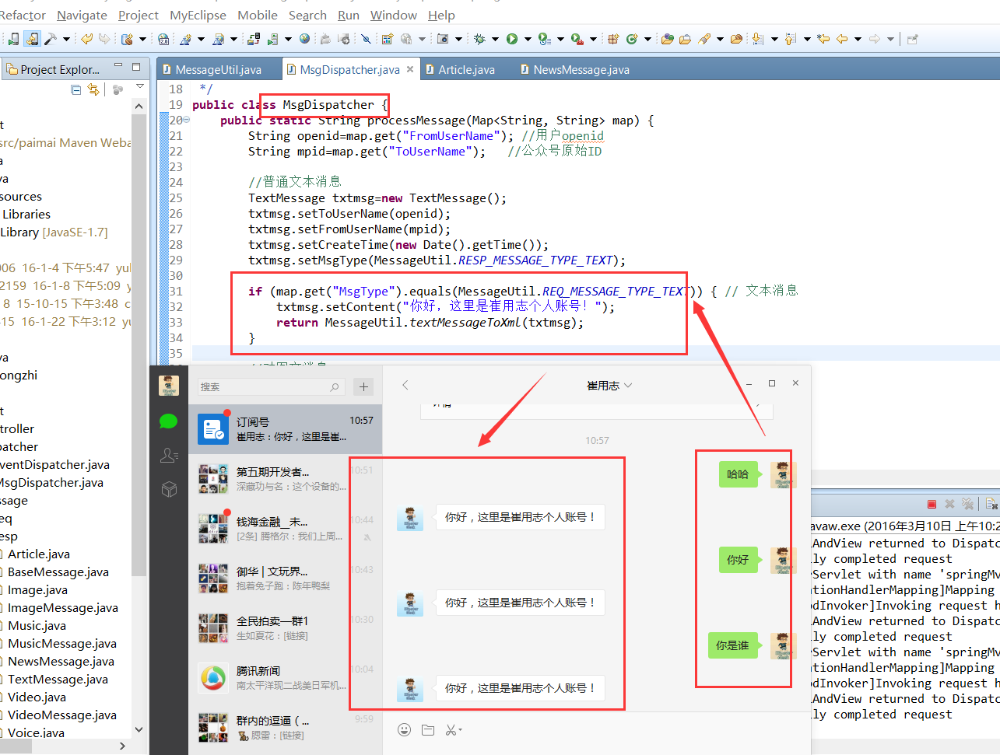
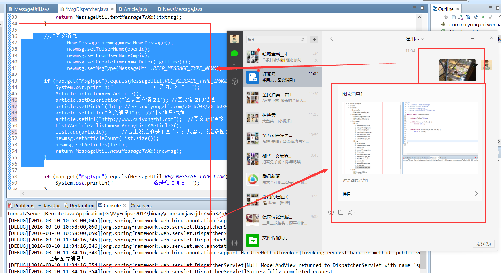

# Java 微信公众平台开发(五)--文本及图文消息回复的实现

上篇我们说到回复消息可以根据是否需要上传文件到微信服务器可划分为【普通消息】和【多媒体消息】，这里我们来讲述普通消息的回复实现，在消息回复中存在一个关键字段【openid】，它是微信用户对于公众号的唯一标识，这里不做过多解释后面将给出时间专门来讲解微信生态中的关键字！

**（一）回复文本消息**

在前面我们已经完成了对消息的分类和回复消息实体的建立，这里回复文本消息需要用到的就是我们的 TextMessage，我们把回复文本消息在【文本消息】类型中给出回复！在我们做消息回复的时候需要设置消息的接收人 ToUserName（openid）、消息的发送方 FromUserName、消息类型 MsgType、创建时间 CreateTime 以及消息体 Content，由于我们我们的消息回复格式是需要为 xml，所以最终我们需要将其装换成 xml 再做返回输出！

首先我们在工具类 MessageUtil 的代码做出部分修改和添加，实现最后版本为：

```
package com.cuiyongzhi.wechat.util;
 
import java.io.InputStream;
import java.io.Writer;
import java.util.HashMap;
import java.util.List;
import java.util.Map;
 
import javax.servlet.http.HttpServletRequest;
 
import org.dom4j.Document;
import org.dom4j.Element;
import org.dom4j.io.SAXReader;
 
import com.cuiyongzhi.wechat.message.resp.Article;
import com.cuiyongzhi.wechat.message.resp.ImageMessage;
import com.cuiyongzhi.wechat.message.resp.MusicMessage;
import com.cuiyongzhi.wechat.message.resp.NewsMessage;
import com.cuiyongzhi.wechat.message.resp.TextMessage;
import com.cuiyongzhi.wechat.message.resp.VideoMessage;
import com.cuiyongzhi.wechat.message.resp.VoiceMessage;
import com.thoughtworks.xstream.XStream;
import com.thoughtworks.xstream.core.util.QuickWriter;
import com.thoughtworks.xstream.io.HierarchicalStreamWriter;
import com.thoughtworks.xstream.io.xml.PrettyPrintWriter;
import com.thoughtworks.xstream.io.xml.XppDriver;
 
/**
 * ClassName: MessageUtil
 * 
 * @Description: 消息工具类
 * @author dapengniao
 * @date 2016 年 3 月 7 日 上午 10:05:04
 */
public class MessageUtil {
 
    /**
     * 返回消息类型：文本
     */
    public static final String RESP_MESSAGE_TYPE_TEXT = "text";
 
    /**
     * 返回消息类型：音乐
     */
    public static final String RESP_MESSAGE_TYPE_MUSIC = "music";
 
    /**
     * 返回消息类型：图文
     */
    public static final String RESP_MESSAGE_TYPE_NEWS = "news";
 
    /**
     * 返回消息类型：图片
     */
    public static final String RESP_MESSAGE_TYPE_Image = "image";
 
    /**
     * 返回消息类型：语音
     */
    public static final String RESP_MESSAGE_TYPE_Voice = "voice";
 
    /**
     * 返回消息类型：视频
     */
    public static final String RESP_MESSAGE_TYPE_Video = "video";
 
    /**
     * 请求消息类型：文本
     */
    public static final String REQ_MESSAGE_TYPE_TEXT = "text";
 
    /**
     * 请求消息类型：图片
     */
    public static final String REQ_MESSAGE_TYPE_IMAGE = "image";
 
    /**
     * 请求消息类型：链接
     */
    public static final String REQ_MESSAGE_TYPE_LINK = "link";
 
    /**
     * 请求消息类型：地理位置
     */
    public static final String REQ_MESSAGE_TYPE_LOCATION = "location";
 
    /**
     * 请求消息类型：音频
     */
    public static final String REQ_MESSAGE_TYPE_VOICE = "voice";
 
    /**
     * 请求消息类型：视频
     */
    public static final String REQ_MESSAGE_TYPE_VIDEO = "video";
 
    /**
     * 请求消息类型：推送
     */
    public static final String REQ_MESSAGE_TYPE_EVENT = "event";
 
    /**
     * 事件类型：subscribe(订阅)
     */
    public static final String EVENT_TYPE_SUBSCRIBE = "subscribe";
 
    /**
     * 事件类型：unsubscribe(取消订阅)
     */
    public static final String EVENT_TYPE_UNSUBSCRIBE = "unsubscribe";
 
    /**
     * 事件类型：CLICK(自定义菜单点击事件)
     */
    public static final String EVENT_TYPE_CLICK = "CLICK";
 
    /**
     * 事件类型：VIEW(自定义菜单 URl 视图)
     */
    public static final String EVENT_TYPE_VIEW = "VIEW";
 
    /**
     * 事件类型：LOCATION(上报地理位置事件)
     */
    public static final String EVENT_TYPE_LOCATION = "LOCATION";
 
    /**
     * 事件类型：LOCATION(上报地理位置事件)
     */
    public static final String EVENT_TYPE_SCAN = "SCAN";
 
    /**
     * @Description: 解析微信发来的请求（XML）
     * @param @param request
     * @param @return
     * @param @throws Exception
     * @author dapengniao
     * @date 2016 年 3 月 7 日 上午 10:04:02
     */
    @SuppressWarnings("unchecked")
    public static Map<String, String> parseXml(HttpServletRequest request)
            throws Exception {
        // 将解析结果存储在 HashMap 中
        Map<String, String> map = new HashMap<String, String>();
        // 从 request 中取得输入流
        InputStream inputStream = request.getInputStream();
        // 读取输入流
        SAXReader reader = new SAXReader();
        Document document = reader.read(inputStream);
        // 得到 xml 根元素
        Element root = document.getRootElement();
        // 得到根元素的所有子节点
        List<Element> elementList = root.elements();
 
        // 遍历所有子节点
        for (Element e : elementList)
            map.put(e.getName(), e.getText());
 
        // 释放资源
        inputStream.close();
        inputStream = null;
 
        return map;
    }
 
    /**
     * @Description: 文本消息对象转换成 xml
     * @param @param textMessage
     * @param @return
     * @author dapengniao
     * @date 2016 年 3 月 8 日 下午 4:13:22
     */
    public static String textMessageToXml(TextMessage textMessage) {
        xstream.alias("xml", textMessage.getClass());
        return xstream.toXML(textMessage);
    }
 
    /**
     * @Description: 图文消息对象转换成 xml
     * @param @param newsMessage
     * @param @return
     * @author dapengniao
     * @date 2016 年 3 月 8 日 下午 4:14:09
     */
    public static String newsMessageToXml(NewsMessage newsMessage) {
        xstream.alias("xml", newsMessage.getClass());
        xstream.alias("item", new Article().getClass());
        return xstream.toXML(newsMessage);
    }
 
    /**
     * @Description: 图片消息对象转换成 xml
     * @param @param imageMessage
     * @param @return
     * @author dapengniao
     * @date 2016 年 3 月 9 日 上午 9:25:51
     */
    public static String imageMessageToXml(ImageMessage imageMessage) {
        xstream.alias("xml", imageMessage.getClass());
        return xstream.toXML(imageMessage);
    }
 
    /**
     * @Description: 语音消息对象转换成 xml
     * @param @param voiceMessage
     * @param @return
     * @author dapengniao
     * @date 2016 年 3 月 9 日 上午 9:27:26
     */
    public static String voiceMessageToXml(VoiceMessage voiceMessage) {
        xstream.alias("xml", voiceMessage.getClass());
        return xstream.toXML(voiceMessage);
    }
 
    /**
     * @Description: 视频消息对象转换成 xml
     * @param @param videoMessage
     * @param @return
     * @author dapengniao
     * @date 2016 年 3 月 9 日 上午 9:31:09
     */
    public static String videoMessageToXml(VideoMessage videoMessage) {
        xstream.alias("xml", videoMessage.getClass());
        return xstream.toXML(videoMessage);
    }
 
    /**
     * @Description: 音乐消息对象转换成 xml
     * @param @param musicMessage
     * @param @return
     * @author dapengniao
     * @date 2016 年 3 月 8 日 下午 4:13:36
     */
    public static String musicMessageToXml(MusicMessage musicMessage) {
        xstream.alias("xml", musicMessage.getClass());
        return xstream.toXML(musicMessage);
    }
 
    /**
     * 对象到 xml 的处理
     */
    private static XStream xstream = new XStream(new XppDriver() {
        public HierarchicalStreamWriter createWriter(Writer out) {
            return new PrettyPrintWriter(out) {
                // 对所有 xml 节点的转换都增加 CDATA 标记
                boolean cdata = true;
 
                @SuppressWarnings("rawtypes")
                public void startNode(String name, Class clazz) {
                    super.startNode(name, clazz);
                }
 
                protected void writeText(QuickWriter writer, String text) {
                    if (cdata) {
                        writer.write("<![CDATA[");
                        writer.write(text);
                        writer.write("]]>");
                    } else {
                        writer.write(text);
                    }
                }
            };
        }
    });
}
```
我们回复文本消息的简单实现：修改 MsgDispatcher，在消息分类为【文本消息】中加入如下代码：

```
String openid=map.get("FromUserName"); //用户 openid
String mpid=map.get("ToUserName");   //公众号原始 ID
         
//普通文本消息

TextMessage txtmsg=new TextMessage();
txtmsg.setToUserName(openid);
txtmsg.setFromUserName(mpid);
txtmsg.setCreateTime(new Date().getTime());
txtmsg.setMsgType(MessageUtil.RESP_MESSAGE_TYPE_TEXT);
         
if (map.get("MsgType").equals(MessageUtil.REQ_MESSAGE_TYPE_TEXT)) { // 文本消息
    txtmsg.setContent("你好，这里是崔用志个人账号！");
    return MessageUtil.textMessageToXml(txtmsg);
}
```

启动项目，当我们发送任何文本消息后我们可以看到我们的回复内容，如图：



（二）图文消息回复

图文消息的回复和文本消息的实现模式是一样的，只不过对应消息体的字段有所区别而已，这里为了和文本消息能有所区分我在【图片消息】实现图文消息的回复，修改 MsgDispatcher：

```
  //对图文消息
NewsMessage newmsg=new NewsMessage();
newmsg.setToUserName(openid);
newmsg.setFromUserName(mpid);
newmsg.setCreateTime(new Date().getTime());
newmsg.setMsgType(MessageUtil.RESP_MESSAGE_TYPE_NEWS);
         
if (map.get("MsgType").equals(MessageUtil.REQ_MESSAGE_TYPE_IMAGE)) { // 图片消息
    System.out.println("==============这是图片消息！");
    Article article=new Article();
    article.setDescription("这是图文消息 1"); //图文消息的描述
    article.setPicUrl("http://res.cuiyongzhi.com/2016/03/201603086749_6850.png"); //图文消息图片地址
    article.setTitle("图文消息 1");  //图文消息标题
    article.setUrl("http://www.cuiyongzhi.com");  //图文 url 链接
    List<Article> list=new ArrayList<Article>();
    list.add(article);     //这里发送的是单图文，如果需要发送多图文则在这里 list 中加入多个 Article 即可！
    newmsg.setArticleCount(list.size());
    newmsg.setArticles(list);
    return MessageUtil.newsMessageToXml(newmsg);
}      
```

实现结果如下图所示：



在整个的谱图消息发送的过程中没有任何项目结构的变化，只是对文件内容作了简单代码增加和修改，下一篇将讲述【微信开发中的 token 生成】以方便后面多媒体消息发送的讲解，感谢你的查阅，如有疑问获需源码可留言！