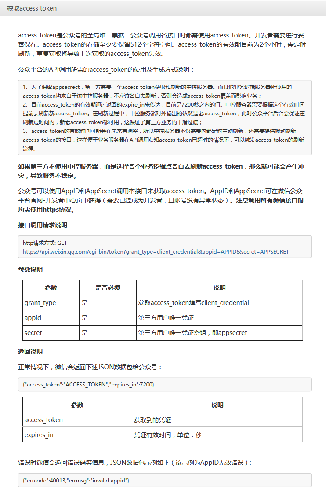
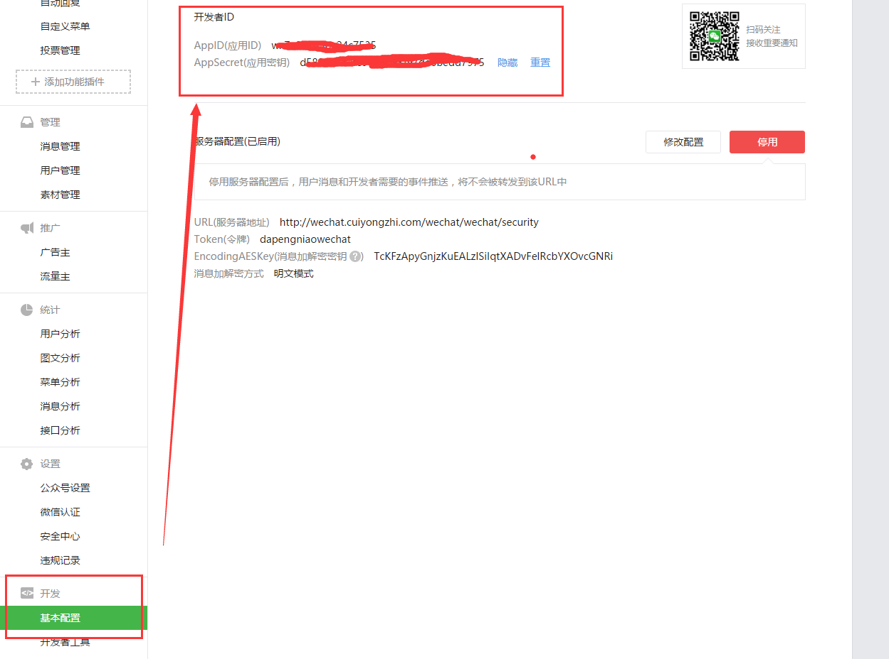
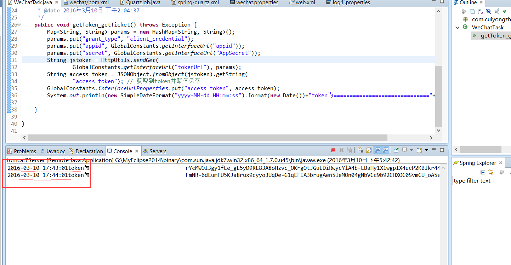

# Java 微信公众平台开发(六)--微信开发中的 token 获取

## （一）token 的介绍

*引用：access_token 是公众号的全局唯一票据，公众号调用各接口时都需使用 access_token。开发者需要进行妥善保存。access_token 的存储至少要保留 512 个字符空间。access_token 的有效期目前为 2 个小时，需定时刷新，重复获取将导致上次获取的 access_token 失效！*

## （二）token 的获取参考文档

获取的流程我们完全可以参考微信官方文档：http://mp.weixin.qq.com/wiki/14/9f9c82c1af308e3b14ba9b973f99a8ba.html 如图：



## （三）token 获取流程分析

从公众平台获取账号的 AppID 和 AppSecret；
token 获取并解析存储执行体；
采用任务调度每隔两小时执行一次 token 获取执行体；

## （四）token 的获取流程的具体实现

1.获取 appid 和 appsecret

在微信公众平台【开发】——>【基本配置】中可以查看到我们需要的两个参数：



这里我们将他们定义到我们的配置文件【wechat.properties】中，大致代码为：

```
#获取到的 appid
appid=wx7e32765bc24XXXX 
#获取到的 AppSecret
AppSecret=d58051564fe9d86093f9XXXXX
```

2.token 获取并解析存储执行体的代码编写

由于在这里我们需要通过 http 的 get 请求向微信服务器获取时效性为 7200 秒的 token，所以我在这里写了一个 http 请求的工具类，以方便我们的使用，如下：

```
package com.cuiyongzhi.wechat.util;
 
import java.io.BufferedInputStream;
import java.io.BufferedReader;
import java.io.IOException;
import java.io.InputStream;
import java.io.InputStreamReader;
import java.io.OutputStreamWriter;
import java.net.MalformedURLException;
import java.net.URI;
import java.net.URL;
import java.net.URLConnection;
import java.util.ArrayList;
import java.util.List;
import java.util.Map;
import java.util.Set;
import java.util.zip.GZIPInputStream;
 
import org.apache.http.HttpResponse;
import org.apache.http.NameValuePair;
import org.apache.http.client.ClientProtocolException;
import org.apache.http.client.HttpClient;
import org.apache.http.client.entity.UrlEncodedFormEntity;
import org.apache.http.client.methods.HttpGet;
import org.apache.http.client.methods.HttpPost;
import org.apache.http.entity.StringEntity;
import org.apache.http.impl.client.DefaultHttpClient;
import org.apache.http.message.BasicNameValuePair;
import org.apache.http.protocol.HTTP;
import org.apache.http.util.EntityUtils;
 
/**
 * ClassName: HttpUtils
 * 
 * @Description: http 请求工具类
 * @author dapengniao
 * @date 2016 年 3 月 10 日 下午 3:57:14
 */
@SuppressWarnings("deprecation")
public class HttpUtils {
 
    /**
     * @Description: http get 请求共用方法
     * @param @param reqUrl
     * @param @param params
     * @param @return
     * @param @throws Exception
     * @author dapengniao
     * @date 2016 年 3 月 10 日 下午 3:57:39
     */
    @SuppressWarnings("resource")
    public static String sendGet(String reqUrl, Map<String, String> params)
            throws Exception {
        InputStream inputStream = null;
        HttpGet request = new HttpGet();
        try {
            String url = buildUrl(reqUrl, params);
            HttpClient client = new DefaultHttpClient();
 
            request.setHeader("Accept-Encoding", "gzip");
            request.setURI(new URI(url));
 
            HttpResponse response = client.execute(request);
 
            inputStream = response.getEntity().getContent();
            String result = getJsonStringFromGZIP(inputStream);
            return result;
        } finally {
            if (inputStream != null) {
                inputStream.close();
            }
            request.releaseConnection();
        }
 
    }
 
    /**
     * @Description: http post 请求共用方法
     * @param @param reqUrl
     * @param @param params
     * @param @return
     * @param @throws Exception
     * @author dapengniao
     * @date 2016 年 3 月 10 日 下午 3:57:53
     */
    @SuppressWarnings("resource")
    public static String sendPost(String reqUrl, Map<String, String> params)
            throws Exception {
        try {
            Set<String> set = params.keySet();
            List<NameValuePair> list = new ArrayList<NameValuePair>();
            for (String key : set) {
                list.add(new BasicNameValuePair(key, params.get(key)));
            }
            if (list.size() > 0) {
                try {
                    HttpClient client = new DefaultHttpClient();
                    HttpPost request = new HttpPost(reqUrl);
 
                    request.setHeader("Accept-Encoding", "gzip");
                    request.setEntity(new UrlEncodedFormEntity(list, HTTP.UTF_8));
 
                    HttpResponse response = client.execute(request);
 
                    InputStream inputStream = response.getEntity().getContent();
                    try {
                        String result = getJsonStringFromGZIP(inputStream);
 
                        return result;
                    } finally {
                        inputStream.close();
                    }
                } catch (Exception ex) {
                    ex.printStackTrace();
                    throw new Exception("网络连接失败,请连接网络后再试");
                }
            } else {
                throw new Exception("参数不全，请稍后重试");
            }
        } catch (Exception ex) {
            ex.printStackTrace();
            throw new Exception("发送未知异常");
        }
    }
 
    /**
     * @Description: http post 请求 json 数据
     * @param @param urls
     * @param @param params
     * @param @return
     * @param @throws ClientProtocolException
     * @param @throws IOException
     * @author dapengniao
     * @date 2016 年 3 月 10 日 下午 3:58:15
     */
    public static String sendPostBuffer(String urls, String params)
            throws ClientProtocolException, IOException {
        HttpPost request = new HttpPost(urls);
 
        StringEntity se = new StringEntity(params, HTTP.UTF_8);
        request.setEntity(se);
        // 发送请求
        @SuppressWarnings("resource")
        HttpResponse httpResponse = new DefaultHttpClient().execute(request);
        // 得到应答的字符串，这也是一个 JSON 格式保存的数据
        String retSrc = EntityUtils.toString(httpResponse.getEntity());
        request.releaseConnection();
        return retSrc;
 
    }
 
    /**
     * @Description: http 请求发送 xml 内容
     * @param @param urlStr
     * @param @param xmlInfo
     * @param @return
     * @author dapengniao
     * @date 2016 年 3 月 10 日 下午 3:58:32
     */
    public static String sendXmlPost(String urlStr, String xmlInfo) {
        // xmlInfo xml 具体字符串
 
        try {
            URL url = new URL(urlStr);
            URLConnection con = url.openConnection();
            con.setDoOutput(true);
            con.setRequestProperty("Pragma:", "no-cache");
            con.setRequestProperty("Cache-Control", "no-cache");
            con.setRequestProperty("Content-Type", "text/xml");
            OutputStreamWriter out = new OutputStreamWriter(
                    con.getOutputStream());
            out.write(new String(xmlInfo.getBytes("utf-8")));
            out.flush();
            out.close();
            BufferedReader br = new BufferedReader(new InputStreamReader(
                    con.getInputStream()));
            String lines = "";
            for (String line = br.readLine(); line != null; line = br
                    .readLine()) {
                lines = lines + line;
            }
            return lines; // 返回请求结果
        } catch (MalformedURLException e) {
            e.printStackTrace();
        } catch (IOException e) {
            e.printStackTrace();
        }
        return "fail";
    }
 
    private static String getJsonStringFromGZIP(InputStream is) {
        String jsonString = null;
        try {
            BufferedInputStream bis = new BufferedInputStream(is);
            bis.mark(2);
            // 取前两个字节
            byte[] header = new byte[2];
            int result = bis.read(header);
            // reset 输入流到开始位置
            bis.reset();
            // 判断是否是 GZIP 格式
            int headerData = getShort(header);
            // Gzip 流 的前两个字节是 0x1f8b
            if (result != -1 && headerData == 0x1f8b) {
                // LogUtil.i("HttpTask", " use GZIPInputStream  ");
                is = new GZIPInputStream(bis);
            } else {
                // LogUtil.d("HttpTask", " not use GZIPInputStream");
                is = bis;
            }
            InputStreamReader reader = new InputStreamReader(is, "utf-8");
            char[] data = new char[100];
            int readSize;
            StringBuffer sb = new StringBuffer();
            while ((readSize = reader.read(data)) > 0) {
                sb.append(data, 0, readSize);
            }
            jsonString = sb.toString();
            bis.close();
            reader.close();
        } catch (Exception e) {
            e.printStackTrace();
        }
 
        return jsonString;
    }
 
    private static int getShort(byte[] data) {
        return (data[0] << 8) | data[1] & 0xFF;
    }
 
    /**
     * 构建 get 方式的 url
     * 
     * @param reqUrl
     *            基础的 url 地址
     * @param params
     *            查询参数
     * @return 构建好的 url
     */
    public static String buildUrl(String reqUrl, Map<String, String> params) {
        StringBuilder query = new StringBuilder();
        Set<String> set = params.keySet();
        for (String key : set) {
            query.append(String.format("%s=%s&", key, params.get(key)));
        }
        return reqUrl + "?" + query.toString();
    }
 
}
```

我们在做 http 请求的时候需要目标服务器的 url，这里在项目中为了方便对 url 的管理我们在资源目录下建立了 interface_url.properties 用于存放目标 url，这里我们将请求 token 的 url 存入：

```
#获取 token 的 url
tokenUrl=https://api.weixin.qq.com/cgi-bin/token
```

我们需要将我们配置的配置文件在项目初始化后能得到启动，所以我在这里加入一个项目初始化的代码实现，用于项目启动初始化 interface_url.properties 和 wechat.properties 中的配置：

```
package com.cuiyongzhi.web.start;
 
import javax.servlet.ServletConfig;
import javax.servlet.ServletException;
import javax.servlet.http.HttpServlet;
 
/**
 * ClassName: InterfaceUrlIntiServlet
 * @Description: 项目启动初始化 servlet
 * @author dapengniao
 * @date 2016 年 3 月 10 日 下午 4:08:43
 */
public class InterfaceUrlIntiServlet extends HttpServlet {
 
    private static final long serialVersionUID = 1L;
 
    @Override
    public void init(ServletConfig config) throws ServletException {
        InterfaceUrlInti.init();
    }
 
}
```

初始化的具体实现，将初始化过后的方法都存入到 GlobalConstants 中方便项目中随意调用，如下：

```
package com.cuiyongzhi.web.start;
 
import java.io.IOException;
import java.io.InputStream;
import java.util.Properties;
 
import com.cuiyongzhi.web.util.GlobalConstants;
 
/**
 * ClassName: InterfaceUrlInti
 * @Description: 项目启动初始化方法
 * @author dapengniao
 * @date 2016 年 3 月 10 日 下午 4:08:21
 */
public class InterfaceUrlInti {
 
    public synchronized static void init(){
        ClassLoader cl = Thread.currentThread().getContextClassLoader();
        Properties props = new Properties();
        if(GlobalConstants.interfaceUrlProperties==null){
            GlobalConstants.interfaceUrlProperties = new Properties();
        }
        InputStream in = null;
        try {
            in = cl.getResourceAsStream("interface_url.properties");
            props.load(in);
            for(Object key : props.keySet()){
                GlobalConstants.interfaceUrlProperties.put(key, props.get(key));
            }
             
            props = new Properties();
            in = cl.getResourceAsStream("wechat.properties");
            props.load(in);
            for(Object key : props.keySet()){
                GlobalConstants.interfaceUrlProperties.put(key, props.get(key));
            }
             
        } catch (IOException e) {
            e.printStackTrace();
        }finally{
            if(in!=null){
                try {
                    in.close();
                } catch (IOException e) {
                    e.printStackTrace();
                }
            }
        }
        return;
    }
 
}
```

当我们把所有的准备工作都做好了之后我们可以开始真正的去获取 token 了，这里我们将获取到的 token 解析之后依然存储到 GlobalConstants 中方便使用，简单代码如下：

```
package com.cuiyongzhi.wechat.common;
 
import java.util.HashMap;
import java.util.Map;
 
import net.sf.json.JSONObject;
 
import com.cuiyongzhi.web.util.GlobalConstants;
import com.cuiyongzhi.wechat.util.HttpUtils;
 
/**
 * ClassName: WeChatTask
 * @Description: 微信两小时定时任务体
 * @author dapengniao
 * @date 2016 年 3 月 10 日 下午 1:42:29
 */
public class WeChatTask {
    /**
     * @Description: 任务执行体
     * @param @throws Exception
     * @author dapengniao
     * @date 2016 年 3 月 10 日 下午 2:04:37
     */
    public void getToken_getTicket() throws Exception {
        Map<String, String> params = new HashMap<String, String>();
        params.put("grant_type", "client_credential");
        params.put("appid", GlobalConstants.getInterfaceUrl("appid"));
        params.put("secret", GlobalConstants.getInterfaceUrl("AppSecret"));
        String jstoken = HttpUtils.sendGet(
                GlobalConstants.getInterfaceUrl("tokenUrl"), params);
        String access_token = JSONObject.fromObject(jstoken).getString(
                "access_token"); // 获取到 token 并赋值保存
        GlobalConstants.interfaceUrlProperties.put("access_token", access_token);
                System.out.println(new SimpleDateFormat("yyyy-MM-dd HH:mm:ss").format(new Date())+"token 为=============================="+access_token);
    }
 
}
```

（三）采用任务调度每隔两小时执行一次 token 获取执行体

我们阅读过微信的文档会发现我们的 token 获取的接口每天是有调用次数限制的，为了防止我们业务量比较大的情况下 token 的直接调用的接口次数不够用，所以我们需要根据 token 的时效性（7200s）在自己的业务服务器上做到 token 的缓存并定时获取，我这里用到的任务调度的方式是采用 quartz，有关 quartz 的使用可以参考文章 http://cuiyongzhi.com/?tags=%E5%AE%9A%E6%97%B6%E4%BB%BB%E5%8A%A1 ，下面具体代码的实现：

```
package com.cuiyongzhi.wechat.quartz;
 
import org.apache.log4j.Logger;
 
import com.cuiyongzhi.wechat.common.WeChatTask;
 
public class QuartzJob{
    private static Logger logger = Logger.getLogger(QuartzJob.class);
    /**
     * @Description: 任务执行获取 token
     * @param    
     * @author dapengniao
     * @date 2016 年 3 月 10 日 下午 4:34:26
     */
    public void workForToken() {
        try {
            WeChatTask timer = new WeChatTask();
            timer.getToken_getTicket();
        } catch (Exception e) {
            logger.error(e, e);
        }
    }
 
 
}
```

这里新建配置文件 spring-quartz.xml 以方便 quartz 任务的管理和启用，这里将我们需要用到的 workForToken()加入到执行任务中：
```
<?xml version="1.0" encoding="UTF-8"?>
<!DOCTYPE beans PUBLIC "-//SPRING//DTD BEAN//EN" "http://www.springframework.org/dtd/spring-beans.dtd">
 
<beans>
    <!-- 要调用的工作类 -->
    <bean id="quartzJob" class="com.cuiyongzhi.wechat.quartz.QuartzJob"></bean>
     
    <!-- 定义调用对象和调用对象的方法 -->
    <bean id="jobtaskForToken"
        class="org.springframework.scheduling.quartz.MethodInvokingJobDetailFactoryBean">
        <!-- 调用的类 -->
        <property name="targetObject">
            <ref bean="quartzJob" />
        </property>
        <!-- 调用类中的方法 -->
        <property name="targetMethod">
            <value>workForToken</value>
        </property>
 
    </bean>
    <!-- 定义触发时间 -->
    <bean id="doTimeForToken" class="org.springframework.scheduling.quartz.CronTriggerBean">
        <property name="jobDetail">
            <ref bean="jobtaskForToken" />
        </property>
        <!-- cron 表达式 -->
        <property name="cronExpression">
            <value>0 0/1 * * * ?</value>
        </property>
    </bean>
 
 
    <!-- 总管理类 如果将 lazy-init='false'那么容器启动就会执行调度程序 -->
    <bean id="startQuertz" lazy-init="false" autowire="no"
        class="org.springframework.scheduling.quartz.SchedulerFactoryBean">
        <property name="triggers">
            <list>
                <ref bean="doTimeForToken" />
            </list>
        </property>
    </bean>
 
</beans>
```

这里我为了测试将执行间隔时间设置成了 1 分钟一次，根据需要可以自行修改执行时间；最后我们需要在我们的 web.xml 启动项中开启 quartz 的使用：
```
<context-param>
        <param-name>contextConfigLocation</param-name>
        <param-value>classpath:spring.xml,classpath:spring-mybatis.xml,classpath:spring-quartz.xml</param-value>
        <!-- ,classpath:spring-quartz.xml 用于做任务调度 任务定时都可以 -->
    </context-param>
```

当这一切都准备完毕之后我们启动项目，会发现每间隔一分钟就会有 token 获取到，这里我是将其存储在项目变量中，但是如果需要考虑到项目横向扩展这里建议将 token 存储到缓存中；运行结果如下：



那么到这里 token 的获取和保存就基本讲完了，下一篇将讲述【多媒体消息的回复】，感谢你的翻阅，如果有需要源码或有疑问可以留言！