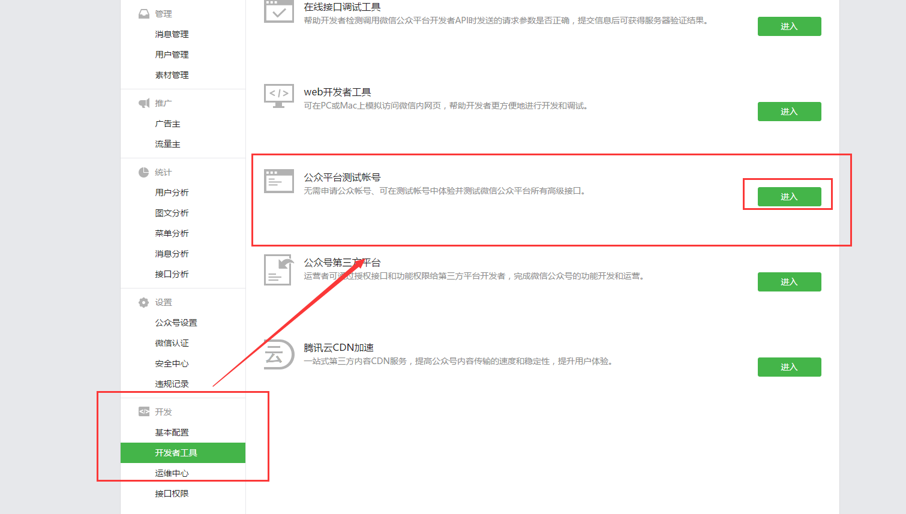
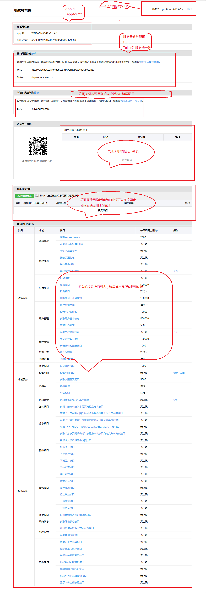

# Java 微信公众平台开发【番外篇】(七)--公众平台测试帐号的申请

前面几篇一直都在写一些比较基础接口的使用，在这个过程中一直使用的都是我个人微博认证的一个个人账号，原本准备这篇是写【多媒体消息回复】的，后来主要到我个人账号的接口权限不够，所以在这里插入一篇【公众平台测试帐号的申请】的文章，同时也提醒各位开发者一定要注意在开发过程中需要注意接口权限，以防想当然的写完代码才发现接口不能使用，但是同样的我们也可以先预演接口的功能然后再将其应用到实际中！

1.登入到微信公众平台，我们到【开发】——>【开发者工具】——>【公众平台测试账号】——进入：\

首次进入可能会需要微信扫描登录，登入之后我们就会发现我们拥有一个 100%接口权限的测试账号了，在这里我们就能无限使用我们的测试接口了，下面简单介绍下测试账号的基本配置,为了方便我就直接在截图上备注了，如下图：

这篇比较简单也比较简短，最后感谢你的翻阅，如有疑问和需要可以留言！