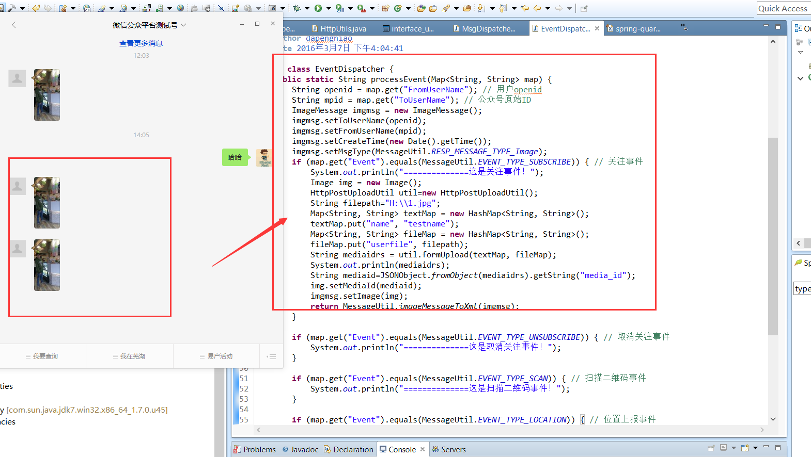

# Java 微信公众平台开发(八)--多媒体消息回复

之前我们在做消息回复的时候我们对回复的消息简单做了分类，前面也有讲述如何回复【普通消息类型消息】，这里将讲述多媒体消息的回复方法，【多媒体消息】包含回复图片消息/回复语音消息/回复视频消息/回复音乐消息，这里以图片消息的回复为例进行讲解！

还记得之前将消息分类的标准就是一种是不需要上传多媒体资源到腾讯服务器的而另外一种是需要的，所以在这里我们所需要做的第一步就是上传资源到腾讯服务器，这里我们调用【素材管理】接口（后面将会有专门的章节讲述）进行图片的上传，同样的这个接口可以提供我们对语音、视频、音乐等消息的管理，这里以图片为例（文档地址：http://mp.weixin.qq.com/wiki/10/10ea5a44870f53d79449290dfd43d006.html  ）。在文档中我们可以发现这里上传的方式是模拟表单的方式上传，然后返回给我们我们需要在回复消息中需要用到的参数：media_id！

（一）素材接口图片上传

按照之前我们的约定将接口请求的 url 写入到配置文件 interface_url.properties 中：
```
#获取 token 的 url
tokenUrl=https://api.weixin.qq.com/cgi-bin/token
#永久多媒体文件上传 url
mediaUrl=http://file.api.weixin.qq.com/cgi-bin/media/upload?access_token=
```

然后我在这里写了一个模拟表单上传的工具类 HttpPostUploadUtil.java,如下：

```
package com.cuiyongzhi.wechat.util;
 
import java.io.BufferedReader;  
import java.io.DataInputStream;  
import java.io.DataOutputStream;  
import java.io.File;  
import java.io.FileInputStream;  
import java.io.InputStreamReader;  
import java.io.OutputStream;  
import java.net.HttpURLConnection;  
import java.net.URL;  
import java.util.Iterator;  
import java.util.Map;  
 
import javax.activation.MimetypesFileTypeMap;
import com.cuiyongzhi.web.util.GlobalConstants;
  
/**
 * ClassName: HttpPostUploadUtil
 * @Description: 多媒体上传
 * @author dapengniao
 * @date 2016 年 3 月 14 日 上午 11:56:55
 */
public class HttpPostUploadUtil {  
     
    public String urlStr; 
     
    public HttpPostUploadUtil(){
        urlStr = "http://file.api.weixin.qq.com/cgi-bin/media/upload?access_token="+GlobalConstants.getInterfaceUrl("access_token")+"&type=image";  
    }
       
       
   
    /** 
     * 上传图片 
     *  
     * @param urlStr 
     * @param textMap 
     * @param fileMap 
     * @return 
     */  
    @SuppressWarnings("rawtypes")
    public String formUpload(Map<String, String> textMap,  
            Map<String, String> fileMap) {  
        String res = "";  
        HttpURLConnection conn = null;  
        String BOUNDARY = "---------------------------123821742118716"; //boundary 就是 request 头和上传文件内容的分隔符  
        try {  
            URL url = new URL(urlStr);  
            conn = (HttpURLConnection) url.openConnection();  
            conn.setConnectTimeout(5000);  
            conn.setReadTimeout(30000);  
            conn.setDoOutput(true);  
            conn.setDoInput(true);  
            conn.setUseCaches(false);  
            conn.setRequestMethod("POST");  
            conn.setRequestProperty("Connection", "Keep-Alive");  
            conn  
                    .setRequestProperty("User-Agent",  
                            "Mozilla/5.0 (Windows; U; Windows NT 6.1; zh-CN; rv:1.9.2.6)");  
            conn.setRequestProperty("Content-Type",  
                    "multipart/form-data; boundary=" + BOUNDARY);  
   
            OutputStream out = new DataOutputStream(conn.getOutputStream());  
            // text  
            if (textMap != null) {  
                StringBuffer strBuf = new StringBuffer();  
                Iterator<?> iter = textMap.entrySet().iterator();  
                while (iter.hasNext()) {  
                    Map.Entry entry = (Map.Entry) iter.next();  
                    String inputName = (String) entry.getKey();  
                    String inputValue = (String) entry.getValue();  
                    if (inputValue == null) {  
                        continue;  
                    }  
                    strBuf.append("\r\n").append("--").append(BOUNDARY).append(  
                            "\r\n");  
                    strBuf.append("Content-Disposition: form-data; name=\""  
                            + inputName + "\"\r\n\r\n");  
                    strBuf.append(inputValue);  
                }  
                out.write(strBuf.toString().getBytes());  
            }  
   
            // file  
            if (fileMap != null) {  
                Iterator<?> iter = fileMap.entrySet().iterator();  
                while (iter.hasNext()) {  
                    Map.Entry entry = (Map.Entry) iter.next();  
                    String inputName = (String) entry.getKey();  
                    String inputValue = (String) entry.getValue();  
                    if (inputValue == null) {  
                        continue;  
                    }  
                    File file = new File(inputValue);  
                    String filename = file.getName();  
                    String contentType = new MimetypesFileTypeMap()  
                            .getContentType(file);  
                    if (filename.endsWith(".jpg")) {  
                        contentType = "image/jpg";  
                    }  
                    if (contentType == null || contentType.equals("")) {  
                        contentType = "application/octet-stream";  
                    }  
   
                    StringBuffer strBuf = new StringBuffer();  
                    strBuf.append("\r\n").append("--").append(BOUNDARY).append(  
                            "\r\n");  
                    strBuf.append("Content-Disposition: form-data; name=\""  
                            + inputName + "\"; filename=\"" + filename  
                            + "\"\r\n");  
                    strBuf.append("Content-Type:" + contentType + "\r\n\r\n");  
   
                    out.write(strBuf.toString().getBytes());  
   
                    DataInputStream in = new DataInputStream(  
                            new FileInputStream(file));  
                    int bytes = 0;  
                    byte[] bufferOut = new byte[1024];  
                    while ((bytes = in.read(bufferOut)) != -1) {  
                        out.write(bufferOut, 0, bytes);  
                    }  
                    in.close();  
                }  
            }  
   
            byte[] endData = ("\r\n--" + BOUNDARY + "--\r\n").getBytes();  
            out.write(endData);  
            out.flush();  
            out.close();  
   
            // 读取返回数据  
            StringBuffer strBuf = new StringBuffer();  
            BufferedReader reader = new BufferedReader(new InputStreamReader(  
                    conn.getInputStream()));  
            String line = null;  
            while ((line = reader.readLine()) != null) {  
                strBuf.append(line).append("\n");  
            }  
            res = strBuf.toString();  
            reader.close();  
            reader = null;  
        } catch (Exception e) {  
            System.out.println("发送 POST 请求出错。" + urlStr);  
            e.printStackTrace();  
        } finally {  
            if (conn != null) {  
                conn.disconnect();  
                conn = null;  
            }  
        }  
        return res;  
    }  
   
}
```

我们将工具类写好之后就需要在我们消息回复中加入对应的响应代码，这里为了测试我将响应代码加在【关注事件】中！

（二）图片回复

这里我们需要修改的是我们的【事件消息业务分发器】的代码，这里我们将我们的回复加在【关注事件】中，简单代码如下：

```
String openid = map.get("FromUserName"); // 用户 openid
String mpid = map.get("ToUserName"); // 公众号原始 ID
ImageMessage imgmsg = new ImageMessage();
imgmsg.setToUserName(openid);
imgmsg.setFromUserName(mpid);
imgmsg.setCreateTime(new Date().getTime());
imgmsg.setMsgType(MessageUtil.RESP_MESSAGE_TYPE_Image);
if (map.get("Event").equals(MessageUtil.EVENT_TYPE_SUBSCRIBE)) { // 关注事件
    System.out.println("==============这是关注事件！");
    Image img = new Image();
    HttpPostUploadUtil util=new HttpPostUploadUtil();
    String filepath="H:\\1.jpg";  
    Map<String, String> textMap = new HashMap<String, String>();  
    textMap.put("name", "testname");  
    Map<String, String> fileMap = new HashMap<String, String>();  
    fileMap.put("userfile", filepath); 
    String mediaidrs = util.formUpload(textMap, fileMap);
    System.out.println(mediaidrs);
    String mediaid=JSONObject.fromObject(mediaidrs).getString("media_id");
    img.setMediaId(mediaid);
    imgmsg.setImage(img);
    return MessageUtil.imageMessageToXml(imgmsg);
}
```

到这里代码基本就已经完成整个的图片消息回复的内容，同样的不论是语音回复、视频回复等流程都是一样的，所以其他的就不在做过多的讲述了，最后的大致效果如下：



正常的消息回复的内容我们就讲述的差不多了，下一篇我们讲述基于消息回复的一些应用【关键字回复及超链接回复】的实现，感谢你的翻阅，如有疑问可以留言讨论！