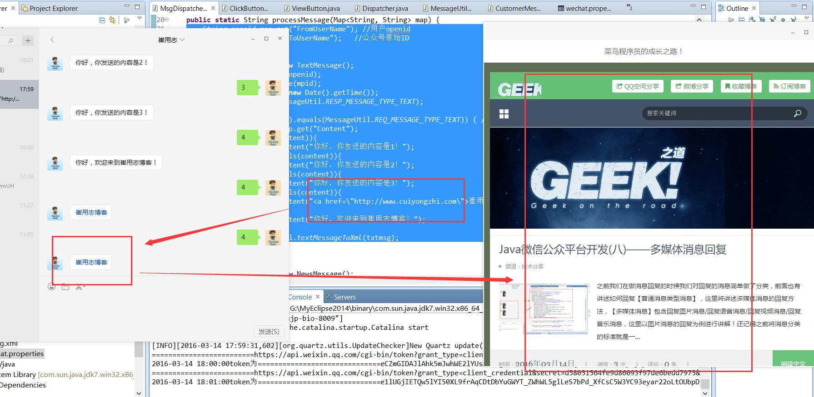
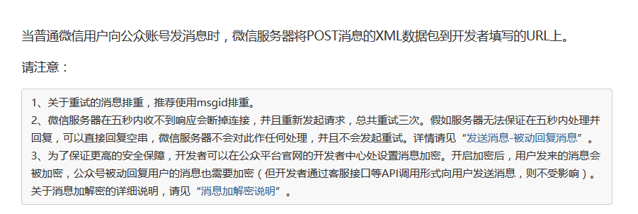

# Java 微信公众平台开发(九)--关键字回复以及客服接口实现（该公众号暂时无法提供服务解决方案）

我们在微信公众号的后台可以发现微信给我们制定了两种模式，一种是开发者模式（也就是我们一直在做的开发），还有一种模式是编辑模式，然而很蛋疼的是有些功能一旦我们切换到开发者模式下就无法使用了，比较典型的就是关键字回复以及服务器无响应的时候返回的【服务器无法响应】等问题 ，这里我给出的解决方案是：1.对关键字给出关键字回复的代码实现；2.【服务器 5s 无响应】解决方案是接入多客服，以方便我们的消息处理！

（一）关键字自动回复

在前面的文章中我们已经完成对消息回复的分类以及实现，这里说的关键字回复只是对消息回复功能的应用化，这里我在【文本类型消息】下实现，其大致思路是：首先获取到消息文本的内容 content，然后更具获取 content 去匹配自己需要设定的关键字，然后根据匹配到的不同结果给出不同的消息回复，简单代码如下：
```
String openid=map.get("FromUserName"); //用户 openid
String mpid=map.get("ToUserName");   //公众号原始 ID
 
//普通文本消息
TextMessage txtmsg=new TextMessage();
txtmsg.setToUserName(openid);
txtmsg.setFromUserName(mpid);
txtmsg.setCreateTime(new Date().getTime());
txtmsg.setMsgType(MessageUtil.RESP_MESSAGE_TYPE_TEXT);
 
if (map.get("MsgType").equals(MessageUtil.REQ_MESSAGE_TYPE_TEXT)) { // 文本消息
    String content=map.get("Content");
    if("1".equals(content)){
        txtmsg.setContent("你好，你发送的内容是 1！");
    }else if("2".equals(content)){
        txtmsg.setContent("你好，你发送的内容是 2！");
    }else if("3".equals(content)){
        txtmsg.setContent("你好，你发送的内容是 3！");
    }else if("4".equals(content)){
        txtmsg.setContent("<a href=\"http://www.cuiyongzhi.com\">崔用志博客</a>");
    }else{
        txtmsg.setContent("你好，欢迎来到崔用志博客！");
    }
    return MessageUtil.textMessageToXml(txtmsg);
}
```

基本关键字回复的逻辑就是这样，你可以根据自己的需要设置自己的关键字以及实现流程，最终运行结果如下：



（二）该公众号暂时无法提供服务解决方案——多客服接口使用

在我们使用或者开发过程中可能会遇到【该公众号暂时无法提供服务】的回复，出现这个回复的原因是我们的应用服务在 5s 内没有给到腾讯服务器任何响应，腾讯服务器给用户的自动响应提示，如何解决以及避免这种情况的出现，我们可以有如下解决方案：

1.直接给微信服务器回复【空】，注意这里是直接回复空而不是回复内容为空！



所以我们的代码实现为：
```
       //这个是错误代码回复
    if (map.get("MsgType").equals(MessageUtil.REQ_MESSAGE_TYPE_LINK)) { // 链接消息
        txtmsg.setContent("");
        return MessageUtil.textMessageToXml(txtmsg);
    }
     
    //这个是正确代码回复
    if (map.get("MsgType").equals(MessageUtil.REQ_MESSAGE_TYPE_LOCATION)) { // 位置消息
        System.out.println("==============这是位置消息！");
        return "";
    }

```

2.将消息转接到多客服助手，让客服去做消息的处理！

新建客服消息实体类 CustomerMessage.java,简单代码如下：

```
package com.cuiyongzhi.wechat.message.resp;
 
/**
 * ClassName: CustomerMessage
 * @Description: 客服消息接口
 * @author dapengniao
 * @date 2016 年 3 月 14 日 下午 6:28:08
 */
public class CustomerMessage {
    // 接收方帐号（收到的 OpenID）
    private String ToUserName;
    // 开发者微信号
    private String FromUserName;
    // 消息创建时间 （整型）
    private long CreateTime;
    // 消息类型（text/music/news）
    private String MsgType;
 
    public String getToUserName() {
        return ToUserName;
    }
 
    public void setToUserName(String toUserName) {
        ToUserName = toUserName;
    }
 
    public String getFromUserName() {
        return FromUserName;
    }
 
    public void setFromUserName(String fromUserName) {
        FromUserName = fromUserName;
    }
 
    public long getCreateTime() {
        return CreateTime;
    }
 
    public void setCreateTime(long createTime) {
        CreateTime = createTime;
    }
 
    public String getMsgType() {
        return MsgType;
    }
 
    public void setMsgType(String msgType) {
        MsgType = msgType;
    }
 
}
```

这样就把用户发送的消息转发到多客服助手，这样我们的客服人员就可以对应的答复，方便我们消息的处理！多客服的相关使用和下载可以查看 http://mp.weixin.qq.com/wiki/11/f0e34a15cec66fefb28cf1c0388f68ab.html 。

感谢你的翻阅，如有疑问可以留言讨论，下一篇将讲述【自定义菜单的基本实现】的两种实现方案！