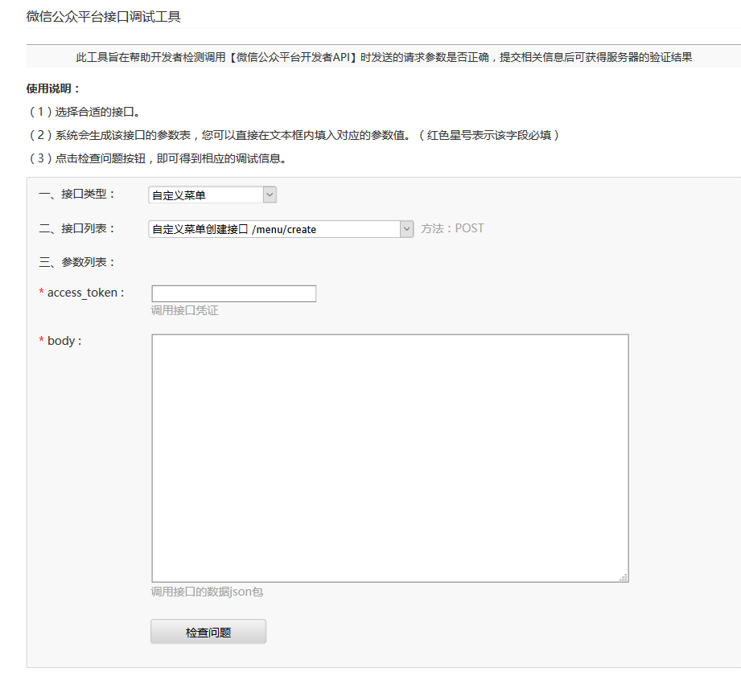
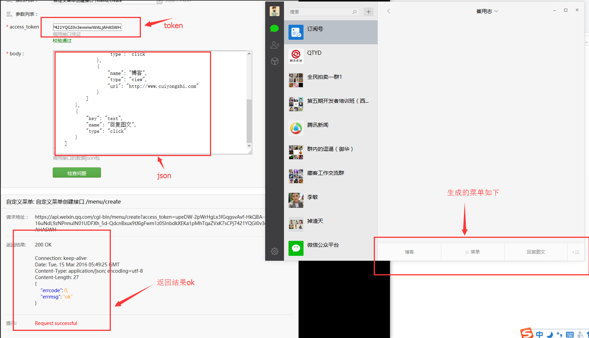
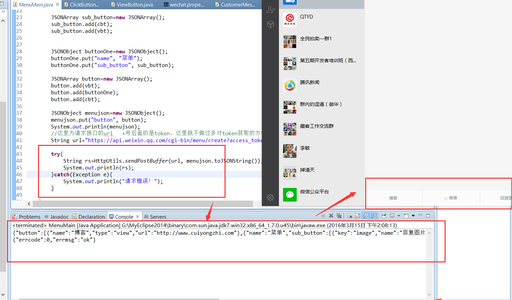

# Java 微信公众平台开发(十)--微信自定义菜单的创建实现

自定义菜单这个功能在我们普通的编辑模式下是可以直接在后台编辑的，但是一旦我们进入开发模式之后我们的自定义菜单就需要自己用代码实现，所以对于刚开始接触的人来说可能存在一定的疑惑，这里我说下平时我们在开发模式下常用的两种自定义菜单的实现方式：①不用写实现代码，直接用网页测试工具 Post json 字符串生成菜单；②就是在我们的开发中用代码实现菜单生成！（参考文档：http://mp.weixin.qq.com/wiki/10/0234e39a2025342c17a7d23595c6b40a.html  ）在自定义菜单中菜单的类型分为两种，一种为 view 的视图菜单，点击之后直接跳转到 url 页面；还有一种是 click 类型的点击型，后端通过点击事件类型给与不同的相应；后面新增了各种特色功能的菜单其本质都还是 Click 类型的菜单，所以生成的规则都是一样的，其生成菜单的方式都是向微信服务器 post json 字符串生成菜单，下面讲述菜单生成的方法和规则！

（一）使用网页调试工具生成菜单

我们通过连接（https://mp.weixin.qq.com/debug/cgi-bin/apiinfo?t=index&type=%E8%87%AA%E5%AE%9A%E4%B9%89%E8%8F%9C%E5%8D%95&form=%E8%87%AA%E5%AE%9A%E4%B9%89%E8%8F%9C%E5%8D%95%E5%88%9B%E5%BB%BA%E6%8E%A5%E5%8F%A3%20/menu/create  ）进入到网页调试工具，如下图：



在这里我们生成菜单的时候只需要我们账号的有效 token 和 json 字符串即可，这里的 json 字符串可以参照文档中的案例做出修改得到，我这里给出的一个案例如下：

```
{
    "button": [
        {
            "name": "博客", 
            "type": "view", 
            "url": "http://www.cuiyongzhi.com"
        }, 
        {
            "name": "菜单", 
            "sub_button": [
                {
                    "key": "text", 
                    "name": "回复图文", 
                    "type": "click"
                }, 
                {
                    "name": "博客", 
                    "type": "view", 
                    "url": "http://www.cuiyongzhi.com"
                }
            ]
        }, 
        {
            "key": "text", 
            "name": "回复图文", 
            "type": "click"
        }
    ]
}
```

我们填入响应的 token，点击检查问题如果返回结果 Ok 就可以了，如下：


到这里我们采用 web 测试工具生成菜单的方式就完成了，下面接着介绍用代码生成菜单！

（二）采用代码实现菜单的生成

前面我们有说道在菜单中有 view 和 click 两种类型的事件，这里我们首先在代码中建立两种类型对应的 java 实体，view 类型建立实体 ViewButton.java 如下：

```
package com.cuiyongzhi.wechat.menu;
 
/**
 * ClassName: ViewButton
 * @Description: 视图型菜单事件
 * @author dapengniao
 * @date 2016 年 3 月 14 日 下午 5:31:38
 */
public class ViewButton {
    private String type;
    private String name;
    private String url;
 
    public String getType() {
        return type;
    }
 
    public void setType(String type) {
        this.type = type;
    }
 
    public String getName() {
        return name;
    }
 
    public void setName(String name) {
        this.name = name;
    }
 
    public String getUrl() {
        return url;
    }
 
    public void setUrl(String url) {
        this.url = url;
    }
 
}
```

同样的建立 click 的实体 ClickButton.java 如下：

```
 
/**
 * ClassName: ClickButton
 * @Description: 点击型菜单事件
 * @author dapengniao
 * @date 2016 年 3 月 14 日 下午 5:31:50
 */
public class ClickButton {
    private String type;
    private String name;
    private String key;
 
    public String getType() {
        return type;
    }
 
    public void setType(String type) {
        this.type = type;
    }
 
    public String getName() {
        return name;
    }
 
    public void setName(String name) {
        this.name = name;
    }
 
    public String getKey() {
        return key;
    }
 
    public void setKey(String key) {
        this.key = key;
    }
 
}
```
这里创建两个实体也是为了方便我们在自定义菜单中对 json 的封装，在这里我用代码的形式封装了上面给出的同样的 json 格式，并调用生成自定义菜单的接口发送到微信服务器，简单代码如下：
```
package com.cuiyongzhi.wechat.menu;
 
import com.alibaba.fastjson.JSONObject;
import com.cuiyongzhi.wechat.util.HttpUtils;
 
import net.sf.json.JSONArray;
 
public class MenuMain {
 
    public static void main(String[] args) {
     
        ClickButton cbt=new ClickButton();
        cbt.setKey("image");
        cbt.setName("回复图片");
        cbt.setType("click");
         
         
        ViewButton vbt=new ViewButton();
        vbt.setUrl("http://www.cuiyongzhi.com");
        vbt.setName("博客");
        vbt.setType("view");
         
        JSONArray sub_button=new JSONArray();
        sub_button.add(cbt);
        sub_button.add(vbt);
         
         
        JSONObject buttonOne=new JSONObject();
        buttonOne.put("name", "菜单");
        buttonOne.put("sub_button", sub_button);
         
        JSONArray button=new JSONArray();
        button.add(vbt);
        button.add(buttonOne);
        button.add(cbt);
         
        JSONObject menujson=new JSONObject();
        menujson.put("button", button);
        System.out.println(menujson);
        //这里为请求接口的 url   +号后面的是 token，这里就不做过多对 token 获取的方法解释
        String url="https://api.weixin.qq.com/cgi-bin/menu/create?access_token="+"upeDW-2pWrHgLx3fGqgsvAvf-HkQBA--5uHOo9OW16uNdL9zNPnnuIN01UDFXh_5d-QdcnBxux9tXigFwm1z0SInbdkXEKa1pMhTqaZVxK7sCPj7421YQGI0v3evwiwiWALjAHASWH";
         
        try{
            String rs=HttpUtils.sendPostBuffer(url, menujson.toJSONString());
            System.out.println(rs);
        }catch(Exception e){
            System.out.println("请求错误！");
        }
     
    }
 
}
```

上面代码的基本流程就是调用 view 和 click 两个实体封装 json 字符串 menujson，最后调用发送方法将 json 发送给腾讯服务器，但是这里需要用到账号生成的 token，我这里是直接写死的（token 的获取方式可以参见 http://www.cuiyongzhi.com/?id=44  ），最终运行返回结果 ok 即可，如下：



自定义菜单的功能实现基本就是这些，下一篇将讲述【微信公众平台（map.weixin.qq.com）/开放平台（open.weixin.qq.com）/商户平台（pay.weixin.qq.com）之间的关联关系】希望可以对你给出帮助，感谢你的翻阅，如有疑问可以留言讨论！