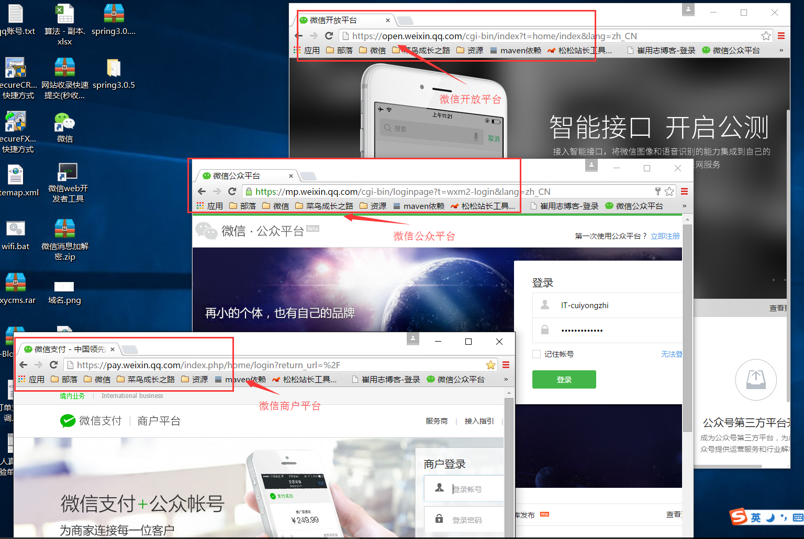
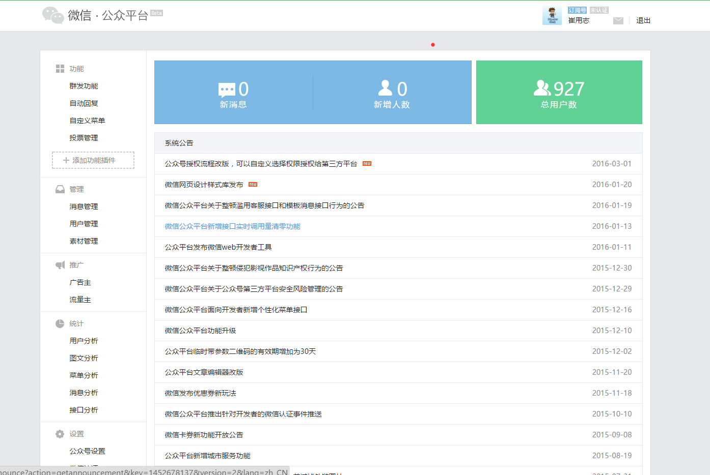
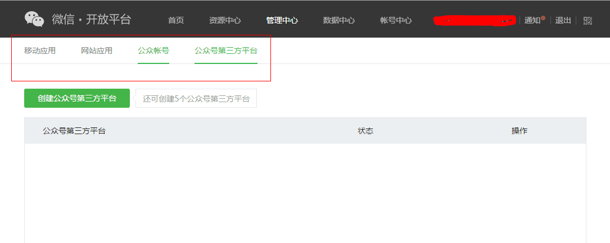
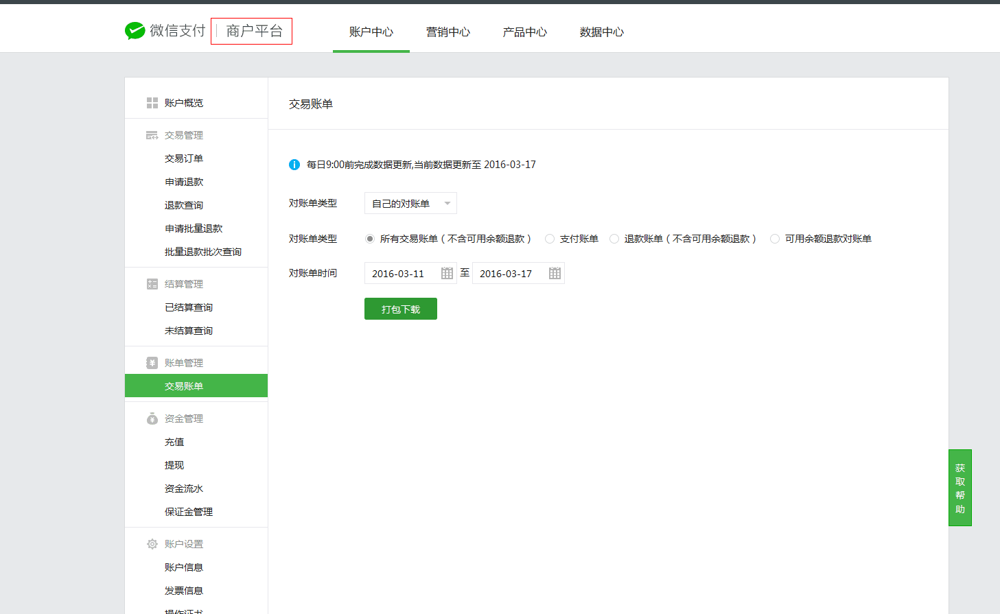
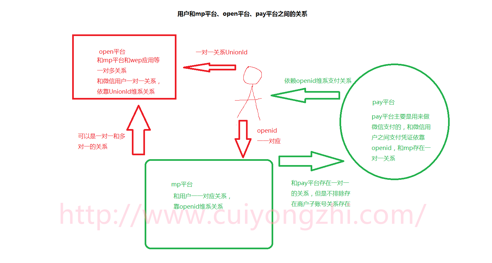

# Java 微信公众平台开发(十一)--开发中微信公众平台/开放平台/商户平台的关联

微信公众平台（map.weixin.qq.com）/开放平台（open.weixin.qq.com）/商户平台（pay.weixin.qq.com）这三个平台不知道大家有没有完全解除到，有人可能因为接触到其中的一个或者两个对其他的有些陌生或者说都不知道他们分别是干什么的，不要紧，那么这篇文章就带领你认知他们，不论你是一个微信开发者还是一个微信运营者，我相信你都会有足够的理由去认知和了解其中的一个或两个！

（一）微信公众平台（map.weixin.qq.com）

官方介绍： 微信公众平台，给个人、企业和组织提供业务服务与用户管理能力的全新服务平台。

这个平台是针对普通用户（个人）、企业、组织提供服务的，是运营和开发者的领地！这里说白了就是订阅号、服务号、企业号给我们提供的服务，而微信公众平台也是提供登录、管理和操作处理这三类账号的平台，从注册到最后的登陆、文章发布、用户管理等操作都可以在这里处理，后面简称 mp 平台！

（二）微信开放平台（open.weixin.qq.com）

官方介绍：开发平台是为微信用户提供服务的平台,而公众平台开发接口则是提供服务的基础,开发者在公众平台网站中创建公众号、获取接口权限后,可以通过阅读本接口文档来帮助开发！

这里主要是开发者的领地！我们可以从官方的介绍中可以发现这个平台主要是为了开发者服务的，其中涉及移动应用、网站应用、公众号开发、公众号第三方平台等有关微信登录、支付以及相关开发文档都可以在这里找到，简直就是微信和其他第三方应用接入的接口大全，后面简称 open 平台！

（三）微信商户平台（pay.weixin.qq.com）

官方介绍：微信支付是腾讯公司的支付业务品牌，微信支付提供公众号支付、APP 支付、扫码支付、刷卡支付等支付方式。微信支付结合微信公众账号，全面打通 O2O 生活消费领域，提供专业的互联网+行业解决方案，微信支付支持微信红包和微信理财通，是移动支付的首选。

在这个商户平台不仅提供开发者有关的开发文档，而且提供流水记录和红包等相关的运营策略，所以这里是开发者，运营者，财务的领地！所有使用微信支付，不论是扫码支付，app 支付等所有的流水订单都可以在这里找到足迹，为我们的每一笔订单提供对账凭证和查询记录，后面简称 pay 平台！

（四）mp 平台、open 平台、pay 平台直接的关联

在我之前讲述的一些开发过程中我们一直用到一个唯一标识 Openid，不知道有没有细心看文档的朋友，会发现在我们的微信开发文档中也有提及到一个唯一标识 UnionID，那么我们一直在用的 Openid 是不是用错了呢？答案当然是没错，这里容我们来详细讲述下 Openid 和 UnionID 之间的关系；

openid 的唯一标识是说在我们的微信公众平台下，一个个人微信对一个微信公众平台帐号（这里可以是订阅号、服务号、企业号）的微信标识，但是我们的 open 平台有个功能是一个开发者账号可以绑定最多 10 个微信公众平台账号、多个网站应用、多个移动应用，这个时候如何在一个微信开发者账号中识别 10 个 map 平台下用户的唯一性呢？这个时候 UnionId 就出现了，所以他的意义是可想而知的，如果在企业中既存在 mp 平台账号又存在 web 应用和移动应用的时候我们为了方便用户的管理和去用户冗余性，在整体的设计中我相信大家都会采用 UnionId 来做微信登录的唯一标识的；但是回过头来说我们说 openid 是唯一标识也是没有错的，因为前面的我们的讲解都是针对单个公众平台账号来说的！

商户平台和用户以及 mp 平台之间的关系又是如何呢？从简单原则上来说 mp 平台和 pay 平台之间是一一对应的关系的，但是也存在微信开发者拥有微信支付开发权限存在微信商户子账号的存在，但是无论如何 pay 平台和用户之间的支付关系都是唯一的都是用过 openid 来产生的，不论是红包支付还是企业支付其依赖关系都是 openid；下面我用我的“简笔画”向大家展示用户、mp 平台、open 平台、pay 平台之间的关系：

开发中微信公众平台/开放平台/商户平台的关联关系讲到这里就基本结束了，下一篇将讲述【微信用户信息的获取】，感谢你的翻阅，如有疑问可以留言讨论！