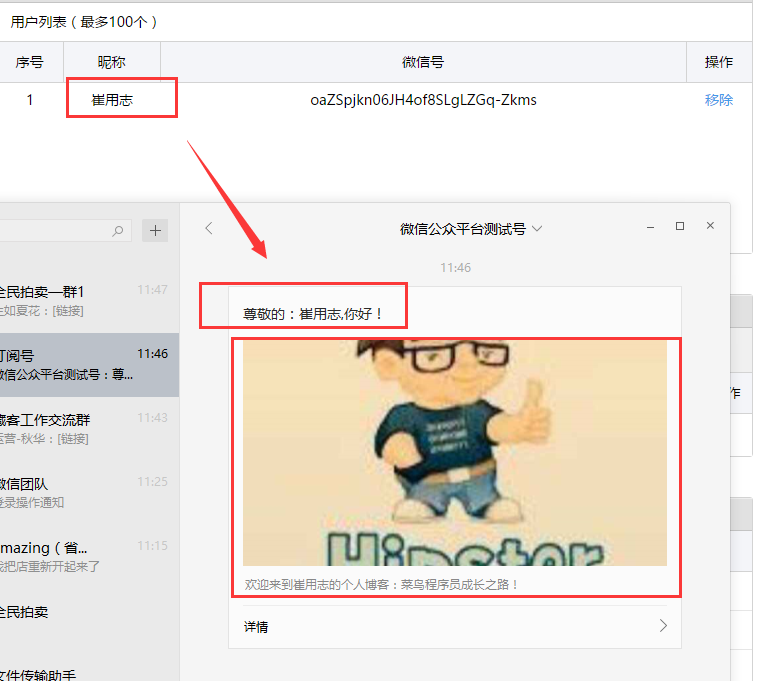
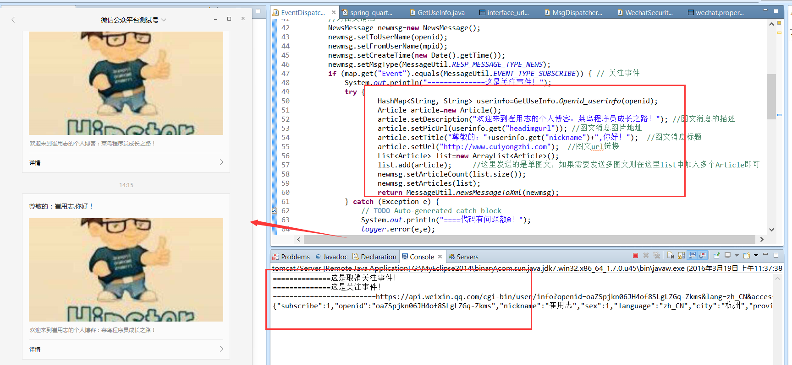

#　Java 微信公众平台开发(十二)--微信用户信息的获取

前面的文章有讲到微信的一系列开发文章，包括 token 获取、菜单创建等，在这一篇将讲述在微信公众平台开发中如何获取微信用户的信息，在上一篇我们有说道微信用户和微信公众账号之间的联系可以通过 Openid 关联，所以在这里我们就采用 openid 去获取用户微信信息，并实现一个简单场景应用：当微信新用户关注我们的微信公众平台的时候我们自动回复一篇图文消息，然后在图文消息中标题为：【尊敬的：XXX,你好！】，而且在图文消息中的图片就是用户的微信头像，如下图：



有关获取微信用户信息的文档我们可以参照：http://mp.weixin.qq.com/wiki/1/8a5ce6257f1d3b2afb20f83e72b72ce9.html 。

（一）用户微信消息的获取实现

在关注者与公众号产生消息交互后，公众号可获得关注者的 OpenID（加密后的微信号，每个用户对每个公众号的 OpenID 是唯一的。对于不同公众号，同一用户的 openid 不同）。公众号可通过本接口来根据 OpenID 获取用户基本信息，包括昵称、头像、性别、所在城市、语言和关注时间。

```
http 请求方式: GET https://api.weixin.qq.com/cgi-bin/user/info?access_token=ACCESS_TOKEN&openid=OPENID&lang=zh_CN
```
在这里我写了一个方法类 GetUseInfo.java,在方法中我们只需要传入 openid 即可返回（昵称，图像、性别【其他参数可自行获取】），代码实现如下：

```
package com.cuiyongzhi.wechat.common;
 
import java.util.HashMap;
import com.cuiyongzhi.web.util.GlobalConstants;
import com.cuiyongzhi.wechat.util.HttpUtils;
 
import net.sf.json.JSONObject;
 
/**
 * ClassName: GetUseInfo
 * @Description: 获取微信用户信息
 * @author dapengniao
 * @date 2016 年 3 月 18 日 下午 2:00:52
 */
public class GetUseInfo {
    /**
     * @Description: 通过 openid 获取用户微信信息
     * @param @param openid
     * @param @return
     * @param @throws Exception   
     * @author dapengniao
     * @date 2016 年 3 月 18 日 下午 2:01:30
     */
    public static HashMap<String, String> Openid_userinfo(String openid)
            throws Exception {
        HashMap<String, String> params = new HashMap<String, String>();
        params.put("access_token",
                GlobalConstants.getInterfaceUrl("access_token"));  //定时器中获取到的 token
        params.put("openid", openid);  //需要获取的用户的 openid
        params.put("lang", "zh_CN");
        String subscribers = HttpUtils.sendGet(
                GlobalConstants.getInterfaceUrl("OpenidUserinfoUrl"), params);
        System.out.println(subscribers);
        params.clear();
        //这里返回参数只取了昵称、头像、和性别
        params.put("nickname",
                JSONObject.fromObject(subscribers).getString("nickname")); //昵称
        params.put("headimgurl",
                JSONObject.fromObject(subscribers).getString("headimgurl"));  //图像
        params.put("sex", JSONObject.fromObject(subscribers).getString("sex"));  //性别
        return params;
    }
 
}
```

（二）关注回复图文消息实现

在第一部分中有说道【在关注者与公众号产生消息交互后，公众号可获得关注者的 OpenID】，在我们的场景中获取关注者 openid 的事件就是用户的关注事件，同时我们也是在关注事件中给关注者被动回复图文消息（图文消息的回复实现可参照：http://www.cuiyongzhi.com/?id=43  ），其实现过程：

通过关注事件获取到 openid，调用获取用户信息接口获取关注者相关接口；
在关注事件被动回复中设置图文消息的 title 以及图片，回复给关注者；
简单代码实现如下：
```
//对图文消息
    NewsMessage newmsg=new NewsMessage();
    newmsg.setToUserName(openid);
    newmsg.setFromUserName(mpid);
    newmsg.setCreateTime(new Date().getTime());
    newmsg.setMsgType(MessageUtil.RESP_MESSAGE_TYPE_NEWS);
    if (map.get("Event").equals(MessageUtil.EVENT_TYPE_SUBSCRIBE)) { // 关注事件
        System.out.println("==============这是关注事件！");
        try {
                HashMap<String, String> userinfo=GetUseInfo.Openid_userinfo(openid);
                Article article=new Article();
                article.setDescription("欢迎来到崔用志的个人博客：菜鸟程序员成长之路！"); //图文消息的描述
                article.setPicUrl(userinfo.get("headimgurl")); //图文消息图片地址
                article.setTitle("尊敬的："+userinfo.get("nickname")+",你好！");  //图文消息标题
                article.setUrl("http://www.cuiyongzhi.com");  //图文 url 链接
                List<Article> list=new ArrayList<Article>();
                list.add(article);     //这里发送的是单图文，如果需要发送多图文则在这里 list 中加入多个 Article 即可！
                newmsg.setArticleCount(list.size());
                newmsg.setArticles(list);
                return MessageUtil.newsMessageToXml(newmsg);
        } catch (Exception e) {
            // TODO Auto-generated catch block
            System.out.println("====代码有问题额☺！");
            logger.error(e,e);
        }
     
    }
```

最终我们可以来看看我们的成果，这里为了看到效果很直观我先取消关注然后再次关注的，如下图：



到这里通过 openid 过去关注者信息的实现就基本结束了，以一篇将讲述【微信 web 中 JSSDK 的开发配置】，感谢你的翻阅，如有疑问可以留言讨论！