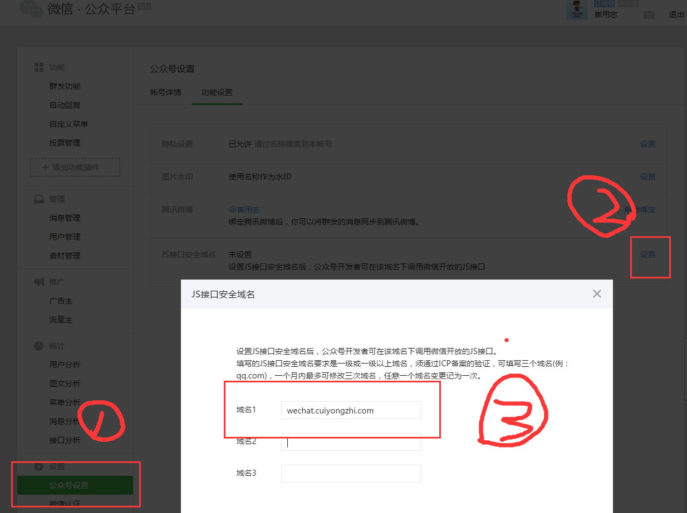
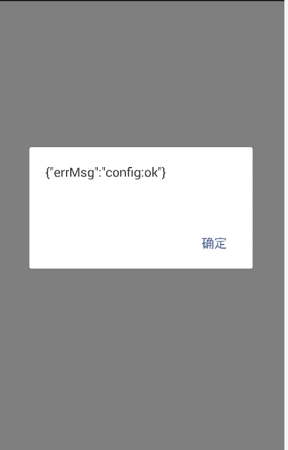

# Java 微信公众平台开发(十三)--微信 JSSDK 中 Config 配置

前端开发工程师和关注前端开发的开发者们在 2015 年中肯定被腾讯的 JSSDk 引爆过，搞 APP 的、搞前端的甚至是是搞后端的都跑过来凑热闹，一时之间也把微信 JSSDK 捧得特别牛逼，但是在我们的技术眼里它的实现原理和根本是不能够被改变的，这篇文章就不对其 js 的实现做任何评价和解说了（因为我也不是很懂，哈哈），这里要说的是它的 config 配置实现，参考文档：http://mp.weixin.qq.com/wiki/11/74ad127cc054f6b80759c40f77ec03db.html  ！

微信 JS-SDK 是微信公众平台面向网页开发者提供的基于微信内的网页开发工具包，通过使用微信 JS-SDK，网页开发者可借助微信高效地使用拍照、选图、语音、位置等手机系统的能力，同时可以直接使用微信分享、扫一扫、卡券、支付等微信特有的能力，为微信用户提供更优质的网页体验；本篇将面向网页开发者介绍微信 JS-SDK 如何使用及相关注意事项！JSSDK 使用步骤：

步骤一：在微信公众平台绑定安全域名
步骤二：后端接口实现 JS-SDK 配置需要的参数
步骤三：页面实现 JS-SDk 中 config 的注入配置，并实现对成功和失败的处理

## （一）在微信公众平台绑定安全域名

先登录微信公众平台进入“公众号设置”的“功能设置”里填写“JS 接口安全域名”(如下图)，如果需要使用支付类接口，需要确保支付目录在支付的安全域名下，否则将无法完成支付！（注：登录后可在“开发者中心”查看对应的接口权限）



## （二）后端接口实现 JS-SDK 配置需要的参数

```
wx.config({
    debug: true, // 开启调试模式,调用的所有 api 的返回值会在客户端 alert 出来，若要查看传入的参数，可以在 pc 端打开，参数信息会通过 log 打出，仅在 pc 端时才会打印。
    appId: '', // 必填，公众号的唯一标识
    timestamp: , // 必填，生成签名的时间戳
    nonceStr: '', // 必填，生成签名的随机串
    signature: '',// 必填，签名，见附录 1
    jsApiList: [] // 必填，需要使用的 JS 接口列表，所有 JS 接口列表见附录 2
});
```

我们查看 js-sdk 的配置文档和以上的代码可以发现 config 的配置需要 4 个必不可少的参数 appId、timestamp、nonceStr、signature，这里的 signature 就是我们生成的签名！

生成签名之前必须先了解一下 jsapi_ticket，jsapi_ticket 是公众号用于调用微信 JS 接口的临时票据。正常情况下，jsapi_ticket 的有效期为 7200 秒，通过 access_token 来获取。由于获取 jsapi_ticket 的 api 调用次数非常有限，频繁刷新 jsapi_ticket 会导致 api 调用受限，影响自身业务，开发者必须在自己的服务全局缓存 jsapi_ticket ,所以这里我们将 jsapi_ticket 的获取放到定时任务中，因为它和 token 的生命周期是一致的，所以在这里我们将他们放到一起，将原有的定时任务中获取 token 的代码做如下修改：

```
package com.cuiyongzhi.wechat.common;
 
import java.text.SimpleDateFormat;
import java.util.Date;
import java.util.HashMap;
import java.util.Map;
 
import net.sf.json.JSONObject;
 
import com.cuiyongzhi.web.util.GlobalConstants;
import com.cuiyongzhi.wechat.util.HttpUtils;
 
/**
 * ClassName: WeChatTask
 * @Description: 微信两小时定时任务体
 * @author dapengniao
 * @date 2016 年 3 月 10 日 下午 1:42:29
 */
public class WeChatTask {
    /**
     * @Description: 任务执行体
     * @param @throws Exception
     * @author dapengniao
     * @date 2016 年 3 月 10 日 下午 2:04:37
     */
    public void getToken_getTicket() throws Exception {
        Map<String, String> params = new HashMap<String, String>();
        //获取 token 执行体
        params.put("grant_type", "client_credential");
        params.put("appid", GlobalConstants.getInterfaceUrl("appid"));
        params.put("secret", GlobalConstants.getInterfaceUrl("AppSecret"));
        String jstoken = HttpUtils.sendGet(
                GlobalConstants.getInterfaceUrl("tokenUrl"), params);
        String access_token = JSONObject.fromObject(jstoken).getString(
                "access_token"); // 获取到 token 并赋值保存
        GlobalConstants.interfaceUrlProperties.put("access_token", access_token);
         
        //获取 jsticket 的执行体
        params.clear();
        params.put("access_token", access_token);
        params.put("type", "jsapi");
        String jsticket = HttpUtils.sendGet(
                GlobalConstants.getInterfaceUrl("ticketUrl"), params);
        String jsapi_ticket = JSONObject.fromObject(jsticket).getString(
                "ticket"); 
        GlobalConstants.interfaceUrlProperties
        .put("jsapi_ticket", jsapi_ticket); // 获取到 js-SDK 的 ticket 并赋值保存
         
        System.out.println("jsapi_ticket================================================" + jsapi_ticket);
        System.out.println(new SimpleDateFormat("yyyy-MM-dd HH:mm:ss").format(new Date())+"token 为=============================="+access_token);
 
    }
 
}
```

然后我们根据【JS-SDK 使用权限签名算法】对参数进行签名得到 signature，这里的 url 必须采用前端传递到后端，因为每次的 url 会有所变化，如下：
```
package com.cuiyongzhi.wechat.common;
 
import java.security.MessageDigest;
import java.util.Formatter;
import java.util.HashMap;
import java.util.UUID;
import com.cuiyongzhi.web.util.GlobalConstants;
 
 
/**
 * ClassName: JSSDK_Config
 * @Description: 用户微信前端页面的 jssdk 配置使用
 * @author dapengniao
 * @date 2016 年 3 月 19 日 下午 3:53:23
 */
public class JSSDK_Config {
 
    /**
     * @Description: 前端 jssdk 页面配置需要用到的配置参数
     * @param @return hashmap {appid,timestamp,nonceStr,signature}
     * @param @throws Exception   
     * @author dapengniao
     * @date 2016 年 3 月 19 日 下午 3:53:23
     */
    public static HashMap<String, String> jsSDK_Sign(String url) throws Exception {
        String nonce_str = create_nonce_str();
        String timestamp=GlobalConstants.getInterfaceUrl("timestamp");
        String jsapi_ticket=GlobalConstants.getInterfaceUrl("jsapi_ticket");
        // 注意这里参数名必须全部小写，且必须有序
        String  string1 = "jsapi_ticket=" + jsapi_ticket + "&noncestr=" + nonce_str
                + "&timestamp=" + timestamp  + "&url=" + url;
        MessageDigest crypt = MessageDigest.getInstance("SHA-1");
        crypt.reset();
        crypt.update(string1.getBytes("UTF-8"));
        String signature = byteToHex(crypt.digest());
        HashMap<String, String> jssdk=new HashMap<String, String>();
        jssdk.put("appId", GlobalConstants.getInterfaceUrl("appid"));
        jssdk.put("timestamp", timestamp);
        jssdk.put("nonceStr", nonce_str);
        jssdk.put("signature", signature);
        return jssdk;
 
    }
     
    private static String byteToHex(final byte[] hash) {
        Formatter formatter = new Formatter();
        for (byte b : hash) {
            formatter.format("%02x", b);
        }
        String result = formatter.toString();
        formatter.close();
        return result;
    }
     
    private static String create_nonce_str() {
        return UUID.randomUUID().toString();
    }
 
}
```

然后我们将后端签名的方法集成到 Controller 层，形成代码如下：
```
package com.cuiyongzhi.wechat.controller;
 
import java.util.Map;
import org.springframework.stereotype.Controller;
import org.springframework.web.bind.annotation.RequestMapping;
import org.springframework.web.bind.annotation.RequestParam;
import com.cuiyongzhi.Message;
import com.cuiyongzhi.wechat.common.JSSDK_Config;
 
/**
 * ClassName: WeChatController
 * @Description: 前端用户微信配置获取
 * @author dapengniao
 * @date 2016 年 3 月 19 日 下午 5:57:36
 */
@Controller
@RequestMapping("/wechatconfig")
public class WeChatController {
 
    /**
     * @Description: 前端获取微信 JSSDK 的配置参数
     * @param @param response
     * @param @param request
     * @param @param url
     * @param @throws Exception
     * @author dapengniao
     * @date 2016 年 3 月 19 日 下午 5:57:52
     */
    @RequestMapping("jssdk")
    public Message JSSDK_config(
            @RequestParam(value = "url", required = true) String url) {
        try {
            System.out.println(url);
            Map<String, String> configMap = JSSDK_Config.jsSDK_Sign(url);
            return Message.success(configMap);
        } catch (Exception e) {
            return Message.error();
        }
 
    }
 
}
```

到这里我们后端对 jssdk 的签名参数的封装就基本完成了，下一步就只需要我们前端调用就可以了！

## （三）页面实现 JS-SDk 中 config 的注入配置，并实现对成功和失败的处理

在第二步中我们将后端接口代码完成了，这里新建 jssdkconfig.jsp，在 jsp 页面用 ajax 方式获取并进行配置，并开启 debug 模式，打开之后就可以看到配置是否成功的提示，简单代码如下：
```
<%@ page language="java" contentType="text/html; charset=UTF-8"
    pageEncoding="UTF-8"%>
<!DOCTYPE html >
<html>
<head>
<meta http-equiv="Content-Type" content="text/html; charset=UTF-8">
<meta name="viewport" content="width=device-width" />
<title>JSSDk 配置</title>
<script src="http://res.wx.qq.com/open/js/jweixin-1.0.0.js"></script>
<script src="http://libs.baidu.com/jquery/2.1.4/jquery.min.js"></script>
<script type="text/javascript">
    function jssdk() {
        $.ajax({
            url : "http://wechat.cuiyongzhi.com/wechatconfig/jssdk",
            type : 'post',
            dataType : 'json',
            contentType : "application/x-www-form-urlencoded; charset=utf-8",
            data : {
                'url' : location.href.split('#')[0]
            },
            success : function(data) {
                wx.config({
                    debug : true,
                    appId : data.data.appId,
                    timestamp : data.data.timestamp,
                    nonceStr : data.data.nonceStr,
                    signature : data.data.signature,
                    jsApiList : [ 'checkJsApi', 'onMenuShareTimeline',
                            'onMenuShareAppMessage', 'onMenuShareQQ',
                            'onMenuShareWeibo', 'hideMenuItems',
                            'showMenuItems', 'hideAllNonBaseMenuItem',
                            'showAllNonBaseMenuItem', 'translateVoice',
                            'startRecord', 'stopRecord', 'onRecordEnd',
                            'playVoice', 'pauseVoice', 'stopVoice',
                            'uploadVoice', 'downloadVoice', 'chooseImage',
                            'previewImage', 'uploadImage', 'downloadImage',
                            'getNetworkType', 'openLocation', 'getLocation',
                            'hideOptionMenu', 'showOptionMenu', 'closeWindow',
                            'scanQRCode', 'chooseWXPay',
                            'openProductSpecificView', 'addCard', 'chooseCard',
                            'openCard' ]
                });
            }
        });
    }
 
    function isWeiXin5() {
        var ua = window.navigator.userAgent.toLowerCase();
        var reg = /MicroMessenger\/[5-9]/i;
        return reg.test(ua);
    }
 
    window.onload = function() {
        //     if (isWeiXin5() == false) {
        //           alert("您的微信版本低于 5.0，无法使用微信支付功能，请先升级！");
        //         }
        jssdk();
    };
</script>
</head>
<body>
</body>
</html>
```

最后我们运行代码，查看运行结果：



如果提示是这样，那么标识我们的配置是成功的，那么到这里微信 jssdk 的配置就基本完成了，下一篇讲述【微信 web 开发者工具】的使用，欢迎你的翻阅，如有疑问可以留言讨论！