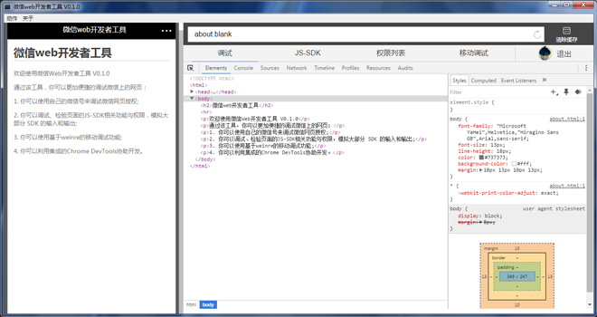
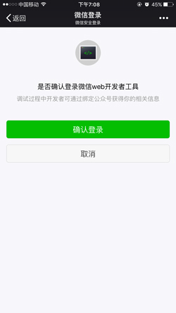
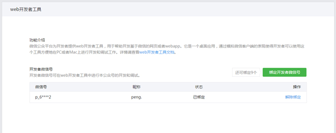
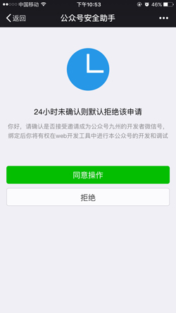
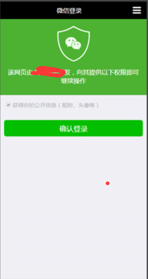
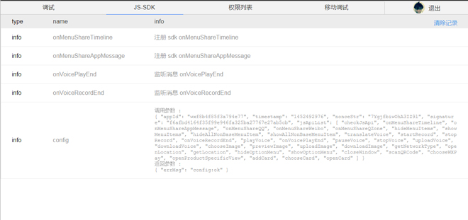
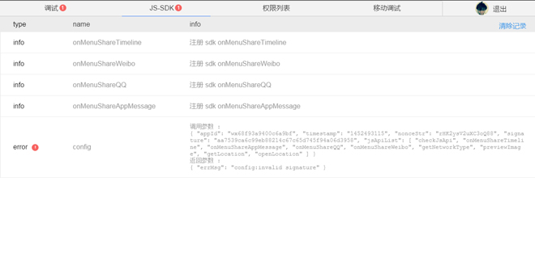
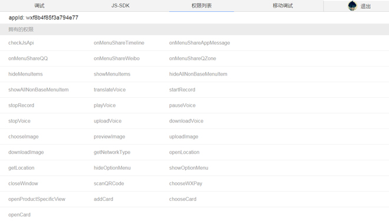
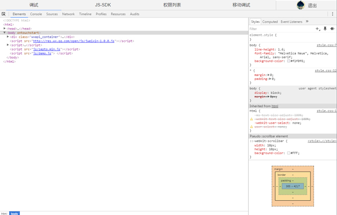

# Java 微信公众平台开发(十四)【番外篇】--微信 web 开发者工具使用

为帮助开发者更方便、更安全地开发和调试基于微信的网页，微信推出了 web 开发者工具。它是一个桌面应用，通过模拟微信客户端的表现，使得开发者可以使用这个工具方便地在 PC 或者 Mac 上进行开发和调试工作。你可以：

- 使用自己的微信号来调试微信网页授权
- 调试、检验页面的 JS-SDK 相关功能与权限，模拟大部分 SDK 的输入和输出
- 使用基于 weinre 的移动调试功能
- 利用集成的 Chrome DevTools 协助开发 

该工具界面主要由几大部分组成，如下图所示：

顶部菜单栏是刷新、后退、选中地址栏等动作的统一入口，以及微信客户端版本的模拟设置页。左侧是微信的 webview 模拟器，可以直接操作网页，模拟用户真实行为。右侧上方是地址栏，用于输入待调试的页面链接，以及清除缓存按钮。右侧下方是相关的请求和返回结果，以及调试界面和登录按钮。

（一）调试微信网页授权

之前在开发基于微信的网页授权的功能时，开发者通常需要手机上输入 URL 进而获取用户信息，从而进行开发和调试工作，可是因为手机的诸多限制，这个过程很不方便。 通过使用微信 web 开发者工具，从此开发者可以直接在 PC 或者 Mac 上进行这种调试了。具体操作步骤为：

1.开发者可以在调试器中点击“登录”，使用手机微信扫码登录，从而使用真实的用户身份（支持测试号）来开发和调试微信网页授权。请确认手机登录页，绑定的公众号为“微信 web 开发者工具”，如下图所示：

 

2.为了保证开发者身份信息的安全，对于希望调试的公众号，我们要求开发者微信号与之建立绑定关系。具体操作为：公众号登录管理后台，启用开发者中心，在开发者工具——web 开发者工具页面，向开发者微信号发送绑定邀请。绑定页面如下图所示： 

3.开发者在手机微信上接受邀请，即可完成绑定。每个公众号最多可同时绑定 10 个开发者微信号。邀请确认页面如下图所示：

4.完成登录和绑定后，开发者就可以开始调试微信网页授权了，注意只能调试自己绑定过的公众号，在微信 web 开发者工具中打开类似的授权页 URL，webview 模拟器显示效果如图：

（二）模拟 JSSDK 权限校验

通过 web 开发者工具，可以模拟 JSSDK 在微信客户端中的请求，并直观地看到鉴权结果和 log。以微信 JSSDK DEMO 页面为例：http://demo.open.weixin.qq.com/jssdk  在调试器中打开该 URL，可以方便地在右侧的 JS-SDK Tab 中看到当前页面 wx.config 的校验情况和 JSSDK 的调用 log。 如下是校验通过的页面：

如下是校验未通过的页面：

在“权限列表” Tab 中，可以查询到当前页面拥有权限的 JS-SDK 列表：

（三）移动调试

我移动调试从来就没有成功过，所以这里不做说明！

（四）Chrome DevTools

微信 web 开发者工具集成了 Chrome DevTools。同之前在 PC 上的调试体验一致，可以快速上手。如下图所示：

下载地址：http://mp.weixin.qq.com/wiki/10/e5f772f4521da17fa0d7304f68b97d7e.html#.E4.B8.8B.E8.BD.BD.E5.9C.B0.E5.9D.80 

微信 web 开发者工具使用的简单介绍就到这里，感谢你的翻阅，如果你有所疑问可以留言讨论！