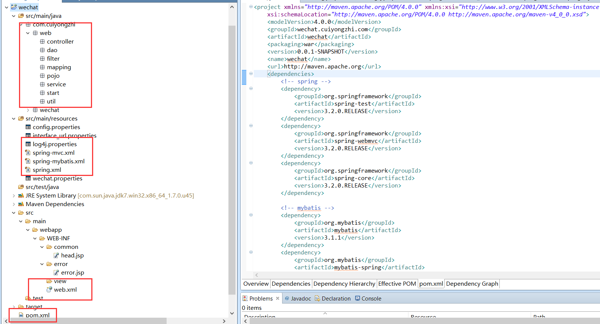

# 微信开发准备(二)--springmvc+mybatis 项目结构的搭建

前面一篇有说道如何在 MyEclipse 中搭建 maven 项目，这里将继续介绍如何在搭建好的基础 maven 项目中引入我们常用的 javaweb 框架——SpringMVC！

1.在建立好的 maven 项目中的 pom.xml 文件引入依赖，代码如下：

```
<project xmlns="http://maven.apache.org/POM/4.0.0" xmlns:xsi="http://www.w3.org/2001/XMLSchema-instance"
    xsi:schemaLocation="http://maven.apache.org/POM/4.0.0 http://maven.apache.org/maven-v4_0_0.xsd">
    <modelVersion>4.0.0</modelVersion>
    <groupId>wechat.cuiyongzhi.com</groupId>
    <artifactId>wechat</artifactId>
    <packaging>war</packaging>
    <version>0.0.1-SNAPSHOT</version>
    <name>wechat</name>
    <url>http://maven.apache.org</url>
    <dependencies>
        <!-- spring -->
        <dependency>
            <groupId>org.springframework</groupId>
            <artifactId>spring-test</artifactId>
            <version>3.2.0.RELEASE</version>
        </dependency>
        <dependency>
            <groupId>org.springframework</groupId>
            <artifactId>spring-webmvc</artifactId>
            <version>3.2.0.RELEASE</version>
        </dependency>
        <dependency>
            <groupId>org.springframework</groupId>
            <artifactId>spring-core</artifactId>
            <version>3.2.0.RELEASE</version>
        </dependency>
 
        <!-- mybatis -->
        <dependency>
            <groupId>org.mybatis</groupId>
            <artifactId>mybatis</artifactId>
            <version>3.1.1</version>
        </dependency>
        <dependency>
            <groupId>org.mybatis</groupId>
            <artifactId>mybatis-spring</artifactId>
            <version>1.1.1</version>
        </dependency>
 
        <!-- mysql -->
        <dependency>
            <groupId>mysql</groupId>
            <artifactId>mysql-connector-java</artifactId>
            <version>5.1.21</version>
        </dependency>
 
        <!-- junit 测试 -->
        <dependency>
            <groupId>junit</groupId>
            <artifactId>junit</artifactId>
            <version>4.11</version>
            <scope>test</scope>
        </dependency>
 
        <!-- mysql 阿里连接池 druid -->
        <dependency>
            <groupId>com.alibaba</groupId>
            <artifactId>druid</artifactId>
            <version>0.2.9</version>
        </dependency>
 
        <!-- spring aop 包 -->
        <dependency>
            <groupId>org.aspectj</groupId>
            <artifactId>aspectjweaver</artifactId>
            <version>1.7.1</version>
        </dependency>
 
        <!-- json 包 -->
        <dependency>
            <groupId>com.alibaba</groupId>
            <artifactId>fastjson</artifactId>
            <version>1.2.7</version>
        </dependency>
 
        <!-- 文件上传包 -->
        <dependency>
            <groupId>commons-fileupload</groupId>
            <artifactId>commons-fileupload</artifactId>
            <version>1.2.2</version>
        </dependency>
 
        <!--servlet 包 -->
        <dependency>
            <groupId>javax.servlet</groupId>
            <artifactId>servlet-api</artifactId>
            <version>3.0-alpha-1</version>
        </dependency>
 
        <dependency>
            <groupId>javax.servlet.jsp</groupId>
            <artifactId>jsp-api</artifactId>
            <version>2.1</version>
            <scope>provided</scope>
        </dependency>
 
        <dependency>
            <groupId>javax.servlet</groupId>
            <artifactId>jstl</artifactId>
            <version>1.2</version>
        </dependency>
 
        <!-- 日志包 -->
        <dependency>
            <groupId>log4j</groupId>
            <artifactId>log4j</artifactId>
            <version>1.2.17</version>
        </dependency>
    </dependencies>
    <build>
        <finalName>wechat</finalName>
    </build>
</project>
```
2.修改项目路径下的 web.xml 文件如下：

```
<?xml version="1.0" encoding="UTF-8"?>
<web-app xmlns:xsi="http://www.w3.org/2001/XMLSchema-instance"
    xmlns:web="http://java.sun.com/xml/ns/javaee" xmlns="http://java.sun.com/xml/ns/javaee"
    xsi:schemaLocation="http://java.sun.com/xml/ns/javaee http://java.sun.com/xml/ns/javaee/web-app_3_0.xsd
    http://www.springframework.org/schema/websocket http://www.springframework.org/schema/websocket/spring-websocket.xsd"
    id="WebApp_ID" version="3.0">
    <display-name>com.cuiyongzhi.wechat</display-name>
    <context-param>
        <param-name>contextConfigLocation</param-name>
        <param-value>classpath:spring.xml,classpath:spring-mybatis.xml</param-value>
        <!-- ,classpath:spring-quartz.xml 用于做任务调度 任务定时都可以 -->
    </context-param>
    <context-param>
        <param-name>log4jConfigLocation</param-name>
        <param-value>classpath:log4j.properties</param-value>
    </context-param>
    <listener>
        <listener-class>org.springframework.web.util.Log4jConfigListener</listener-class>
    </listener>
    <context-param>
        <param-name>spring.profiles.active</param-name>
        <param-value>dev</param-value>
    </context-param>
    <context-param>
        <param-name>spring.profiles.default</param-name>
        <param-value>dev</param-value>
    </context-param>
    <context-param>
        <param-name>spring.liveBeansView.mbeanDomain</param-name>
        <param-value>dev</param-value>
    </context-param>
    <filter>
        <filter-name>encodingFilter</filter-name>
        <filter-class>org.springframework.web.filter.CharacterEncodingFilter</filter-class>
        <init-param>
            <param-name>encoding</param-name>
            <param-value>UTF-8</param-value>
        </init-param>
        <init-param>
            <param-name>forceEncoding</param-name>
            <param-value>true</param-value>
        </init-param>
    </filter>
    <listener>
        <description>spring 监听器</description>
        <listener-class>org.springframework.web.context.ContextLoaderListener</listener-class>
    </listener>
    <!-- 防止内存溢出 -->
    <listener>
        <listener-class>org.springframework.web.util.IntrospectorCleanupListener</listener-class>
    </listener>
    <servlet>
        <description>spring mvc servlet</description>
        <servlet-name>springMvc</servlet-name>
        <servlet-class>org.springframework.web.servlet.DispatcherServlet</servlet-class>
        <init-param>
            <description>spring mvc 配置文件</description>
            <param-name>contextConfigLocation</param-name>
            <param-value>classpath:spring-mvc.xml</param-value>
        </init-param>
        <load-on-startup>1</load-on-startup>
    </servlet>
    <servlet>
        <servlet-name>interface_url-init_servlet</servlet-name>
        <servlet-class>com.cuiyongzhi.web.start.InterfaceUrlIntiServlet</servlet-class>
        <load-on-startup>1</load-on-startup>
    </servlet>
    <servlet-mapping>
        <servlet-name>springMvc</servlet-name>
        <url-pattern>/</url-pattern>
    </servlet-mapping>
 
    <welcome-file-list>
        <welcome-file>/index.jsp</welcome-file>
    </welcome-file-list>
    <session-config>
        <session-timeout>300</session-timeout>
    </session-config>
 
    <error-page>
        <error-code>404</error-code>
        <location>/WEB-INF/error/error.jsp</location>
    </error-page>
 
    <error-page>
        <error-code>500</error-code>
        <location>/WEB-INF/error/error.jsp</location>
    </error-page>
 
    <servlet-mapping>
        <servlet-name>default</servlet-name>
        <url-pattern>*.css</url-pattern>
    </servlet-mapping>
 
    <servlet-mapping>
        <servlet-name>default</servlet-name>
        <url-pattern>*.gif</url-pattern>
    </servlet-mapping>
 
    <servlet-mapping>
        <servlet-name>default</servlet-name>
        <url-pattern>*.jpg</url-pattern>
    </servlet-mapping>
 
    <servlet-mapping>
        <servlet-name>default</servlet-name>
        <url-pattern>*.js</url-pattern>
    </servlet-mapping>
 
    <servlet-mapping>
        <servlet-name>default</servlet-name>
        <url-pattern>*.xhtml</url-pattern>
    </servlet-mapping>
 
    <servlet-mapping>
        <servlet-name>default</servlet-name>
        <url-pattern>*.html</url-pattern>
    </servlet-mapping>
 
    <filter>
        <filter-name>DruidWebStatFilter</filter-name>
        <filter-class>com.alibaba.druid.support.http.WebStatFilter</filter-class>
        <init-param>
            <param-name>exclusions</param-name>
            <param-value>*.js,*.gif,*.jpg,*.png,*.css,*.ico,/druid/*</param-value>
        </init-param>
    </filter>
    <filter-mapping>
        <filter-name>DruidWebStatFilter</filter-name>
        <url-pattern>/*</url-pattern>
    </filter-mapping>
    <servlet>
        <servlet-name>DruidStatView</servlet-name>
        <servlet-class>com.alibaba.druid.support.http.StatViewServlet</servlet-class>
        <init-param>
            <!-- 允许清空统计数据 -->
            <param-name>resetEnable</param-name>
            <param-value>true</param-value>
        </init-param>
        <init-param>
            <!-- 用户名 -->
            <param-name>loginUsername</param-name>
            <param-value>cuiyongzhi</param-value>
        </init-param>
        <init-param>
            <!-- 密码 -->
            <param-name>loginPassword</param-name>
            <param-value>123456</param-value>
        </init-param>
    </servlet>
    <servlet-mapping>
        <servlet-name>DruidStatView</servlet-name>
        <url-pattern>/druid/*</url-pattern>
    </servlet-mapping>
    <!-- 访问监控页面：http://ip：port/projectName/druid/index.html -->
 
    <jsp-config>
        <jsp-property-group>
            <display-name>jspConfiguration</display-name>
            <url-pattern>*.jsp</url-pattern>
            <el-ignored>false</el-ignored>
            <scripting-invalid>false</scripting-invalid>
            <include-prelude>/WEB-INF/common/head.jsp</include-prelude>
        </jsp-property-group>
    </jsp-config>
 
</web-app>
```
3.添加数据库配置信息，这里项目配置的数据库为 mysql，在 resources 下新建 config.properties 配置文件，设置如下：

```
validationQuery=SELECT 1
jdbc_url=jdbc:mysql://127.0.0.1:3306/wechat?useUnicode=true&characterEncoding=UTF-8&zeroDateTimeBehavior=convertToNull
jdbc_username=root  
jdbc_password=123456789
```
4.在 resources 下新建 spring.xml 配置文件，设置如下：

```
<?xml version="1.0" encoding="UTF-8"?>
<beans xmlns="http://www.springframework.org/schema/beans" xmlns:xsi="http://www.w3.org/2001/XMLSchema-instance" xmlns:context="http://www.springframework.org/schema/context" xsi:schemaLocation="
http://www.springframework.org/schema/beans
http://www.springframework.org/schema/beans/spring-beans-3.0.xsd
http://www.springframework.org/schema/context
http://www.springframework.org/schema/context/spring-context-3.0.xsd">
    <!-- 引入属性文件 -->
    <context:property-placeholder location="classpath:config.properties" />
    <!-- 自动扫描(自动注入) -->
    <context:component-scan base-package="com.cuiyongzhi.web.service" />
    <context:component-scan base-package="com.cuiyongzhi.wechat.*" /> 
     
</beans>
```
5.在 resources 下新建 spring-mvc.xml 配置文件，设置如下：

```
<?xml version="1.0" encoding="UTF-8"?>
<beans xmlns="http://www.springframework.org/schema/beans" xmlns:mvc="http://www.springframework.org/schema/mvc" xmlns:xsi="http://www.w3.org/2001/XMLSchema-instance" xmlns:p="http://www.springframework.org/schema/p" xmlns:context="http://www.springframework.org/schema/context" xsi:schemaLocation="http://www.springframework.org/schema/beans 
http://www.springframework.org/schema/beans/spring-beans-4.0.xsd 
http://www.springframework.org/schema/context 
http://www.springframework.org/schema/context/spring-context-4.0.xsd 
http://www.springframework.org/schema/mvc 
http://www.springframework.org/schema/mvc/spring-mvc-4.0.xsd">
 
    <!-- 自动扫描 controller 包下的所有类，使其认为 spring mvc 的控制器 -->
    <context:component-scan base-package="com.cuiyongzhi.web.controller" />
 
    <!-- 避免 IE 执行 AJAX 时,返回 JSON 出现下载文件 -->
    <bean id="mappingJacksonHttpMessageConverter" class="org.springframework.http.converter.json.MappingJacksonHttpMessageConverter">
        <property name="supportedMediaTypes">
            <list>
                <value>text/html;charset=UTF-8</value>
            </list>
        </property>
    </bean>
 
    <!-- 启动 Spring MVC 的注解功能，完成请求和注解 POJO 的映射 -->
    <bean class="org.springframework.web.servlet.mvc.annotation.AnnotationMethodHandlerAdapter">
        <property name="messageConverters">
            <list>
                <ref bean="mappingJacksonHttpMessageConverter" /><!-- json 转换器 -->
            </list>
        </property>
    </bean>
 
    <!-- 对模型视图名称的解析，即在模型视图名称添加前后缀 -->
    <bean class="org.springframework.web.servlet.view.InternalResourceViewResolver" p:prefix="/WEB-INF/views/" p:suffix=".jsp" />
 
    <bean id="multipartResolver" class="org.springframework.web.multipart.commons.CommonsMultipartResolver">
        <property name="defaultEncoding">
            <value>UTF-8</value>
        </property>
        <property name="maxUploadSize">
            <value>32505856</value><!-- 上传文件大小限制为 31M，31*1024*1024 -->
        </property>
        <property name="maxInMemorySize">
            <value>4096</value>
        </property>
    </bean>
     
</beans>
```
6.在 resources 下新建 spring-mybatis.xml 配置文件，设置如下：

```
<?xml version="1.0" encoding="UTF-8"?>
<beans xmlns="http://www.springframework.org/schema/beans" xmlns:xsi="http://www.w3.org/2001/XMLSchema-instance" xmlns:tx="http://www.springframework.org/schema/tx" xmlns:aop="http://www.springframework.org/schema/aop" xsi:schemaLocation="
http://www.springframework.org/schema/beans 
http://www.springframework.org/schema/beans/spring-beans-3.0.xsd 
http://www.springframework.org/schema/tx 
http://www.springframework.org/schema/tx/spring-tx-3.0.xsd
http://www.springframework.org/schema/aop 
http://www.springframework.org/schema/aop/spring-aop-3.0.xsd
">
 
    <!-- 配置数据源 -->
    <bean name="dataSource" class="com.alibaba.druid.pool.DruidDataSource" init-method="init" destroy-method="close">
        <property name="url" value="${jdbc_url}" />
        <property name="username" value="${jdbc_username}" />
        <property name="password" value="${jdbc_password}" />
 
        <!-- 初始化连接大小 -->
        <property name="initialSize" value="5" />
        <!-- 连接池最大使用连接数量 -->
        <property name="maxActive" value="100" />
        <!-- 连接池最大空闲 -->
        <property name="maxIdle" value="10" />
        <!-- 连接池最小空闲 -->
        <property name="minIdle" value="0" />
        <!-- 获取连接最大等待时间 -->
        <property name="maxWait" value="60000" />
 
        <property name="poolPreparedStatements" value="true" />
        <property name="maxPoolPreparedStatementPerConnectionSize" value="33" /> 
 
        <property name="validationQuery" value="${validationQuery}" />
        <property name="testOnBorrow" value="false" />
        <property name="testOnReturn" value="false" />
        <property name="testWhileIdle" value="true" />
 
        <!-- 配置间隔多久才进行一次检测，检测需要关闭的空闲连接，单位是毫秒 -->
        <property name="timeBetweenEvictionRunsMillis" value="60000" />
        <!-- 配置一个连接在池中最小生存的时间，单位是毫秒 -->
        <property name="minEvictableIdleTimeMillis" value="25200000" />
 
        <!-- 打开 removeAbandoned 功能 -->
        <property name="removeAbandoned" value="true" />
        <!-- 1800 秒，也就是 30 分钟 -->
        <property name="removeAbandonedTimeout" value="1800" />
        <!-- 关闭 abanded 连接时输出错误日志 -->
        <property name="logAbandoned" value="true" />
 
        <!-- 监控数据库 -->
        <!-- <property name="filters" value="stat" /> -->
        <property name="filters" value="mergeStat" />
    </bean>
 
    <!-- myBatis 文件 -->
    <bean id="sqlSessionFactory" class="org.mybatis.spring.SqlSessionFactoryBean">
        <property name="dataSource" ref="dataSource" />
        <!-- 自动扫描 entity 目录, 省掉 Configuration.xml 里的手工配置 -->
        <property name="mapperLocations" value="classpath:com/cuiyongzhi/web/mapping/*.xml" />
    </bean>
 
    <bean class="org.mybatis.spring.mapper.MapperScannerConfigurer">
        <property name="basePackage" value="com.cuiyongzhi.web.dao" />
        <property name="sqlSessionFactoryBeanName" value="sqlSessionFactory" />
    </bean>
 
    <!-- 配置事务管理器 -->
    <bean id="transactionManager" class="org.springframework.jdbc.datasource.DataSourceTransactionManager">
        <property name="dataSource" ref="dataSource" />
    </bean>
 
    <!-- 注解方式配置事物 -->
    <!-- <tx:annotation-driven transaction-manager="transactionManager" /> -->
 
    <!-- 拦截器方式配置事物 -->
    <tx:advice id="transactionAdvice" transaction-manager="transactionManager">
        <tx:attributes>
            <tx:method name="add*" propagation="REQUIRED" />
            <tx:method name="append*" propagation="REQUIRED" />
            <tx:method name="insert*" propagation="REQUIRED" />
            <tx:method name="save*" propagation="REQUIRED" />
            <tx:method name="update*" propagation="REQUIRED" />
            <tx:method name="modify*" propagation="REQUIRED" />
            <tx:method name="edit*" propagation="REQUIRED" />
            <tx:method name="delete*" propagation="REQUIRED" />
            <tx:method name="remove*" propagation="REQUIRED" />
            <tx:method name="repair" propagation="REQUIRED" />
            <tx:method name="delAndRepair" propagation="REQUIRED" />
            <tx:method name="get*" propagation="SUPPORTS" />
            <tx:method name="find*" propagation="SUPPORTS" />
            <tx:method name="load*" propagation="SUPPORTS" />
            <tx:method name="search*" propagation="SUPPORTS" />
            <tx:method name="datagrid*" propagation="SUPPORTS" />
            <tx:method name="*" propagation="SUPPORTS" />
        </tx:attributes>
    </tx:advice>
    <aop:config>
        <aop:pointcut id="transactionPointcut" expression="execution(* com.cuiyongzhi.web.service..*Impl.*(..))" />
        <aop:advisor pointcut-ref="transactionPointcut" advice-ref="transactionAdvice" />
    </aop:config>
 
 
    <!-- 配置 druid 监控 spring jdbc -->
    <bean id="druid-stat-interceptor" class="com.alibaba.druid.support.spring.stat.DruidStatInterceptor">
    </bean>
    <bean id="druid-stat-pointcut" class="org.springframework.aop.support.JdkRegexpMethodPointcut" scope="prototype">
        <property name="patterns">
            <list>
                <value>com.cuiyongzhi.web.service.*</value>
            </list>
        </property>
    </bean>
    <aop:config>
        <aop:advisor advice-ref="druid-stat-interceptor" pointcut-ref="druid-stat-pointcut" />
    </aop:config>
 
</beans>
```

7.在 resources 下新建 log4j.properties 配置文件，用于日志的输出等级以及输出位置设置，设置如下：

```
log4j.rootLogger=DEBUG,Console,File
 
#ERROR,WARN,INFO,DEBUG
 
log4j.appender.Console=org.apache.log4j.ConsoleAppender
log4j.appender.Console.Threshold=DEBUG
log4j.appender.Console.Target=System.out
log4j.appender.Console.layout=org.apache.log4j.PatternLayout
log4j.appender.Console.layout.ConversionPattern=[%p][%d{yyyy-MM-dd HH\:mm\:ss,SSS}][%c]%m%n
 
log4j.appender.File=org.apache.log4j.DailyRollingFileAppender 
log4j.appender.File.File=${catalina.base}/wechatlogs/wechat.log
log4j.appender.File.Threshold=INFO
log4j.appender.File.layout=org.apache.log4j.PatternLayout
log4j.appender.File.Append=true
log4j.appender.File.ImmediateFlush=true
log4j.appender.File.DatePattern=yyyy-MM-dd'.log'
log4j.appender.File.layout.ConversionPattern=[%p][%d{yyyy-MM-dd HH\:mm\:ss,SSS}][%c]%m%n
```
到这里 springmvc+mybatis 的基本配置文件基本就完成了，大致的项目结构如下：



本篇主要以代码示例为主，基本的的项目搭建就记录到这里，下一篇我将简述在这个框架下的一些简单应用，感谢你的翻阅，如有疑问可以留言讨论！