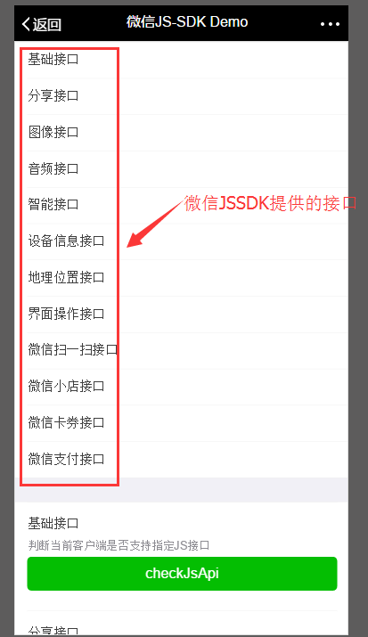

# Java 微信公众平台开发(十五)--微信 JSSDK 的使用

在前面的文章中有介绍到我们在微信 web 开发过程中常常用到的 【微信 JSSDK 中 Config 配置】 ，但是我们在真正的使用中我们不仅仅只是为了配置 Config 而已，而是要在我们的项目中真正去使用微信 JS-SDK 给我们带来便捷，那么这里我们就简述如何在微信 web 开发中使用必要的方法！微信的 JS-SDk 中为我们提供的方法很多，这里我有一个简单截图如下：



在上图的提供的所有口中我们可以按照接口实现的难易程度分成两个部分：

较易实现：基础接口、分享接口、设备信息接口、地理位置接口、界面操作接口、微信扫一扫接口；

较难实现：图像接口、音频接口、智能接口、微信小店接口、微信卡券接口、微信支付接口；（注：这里说较难是因为需要后端和本地文件配合接口，这些接口后面会一篇篇文章具体详解）

在这里我们将讲述所有较易实现的接口的具体实现方法，在文章 http://www.cuiyongzhi.com/index.php/post/57.html  中讲述过了如何配置和引入需要的 js，通过这些配置之后我们就可以开始使用 js 的方法了！

1.基础接口-判断当前浏览器是否支持某些 js 接口

```
/*
 * 注意：
 *  所有的 JS 接口只能在公众号绑定的域名下调用，公众号开发者需要先登录微信公众平台进入“公众号设置”的“功能设置”里填写“JS 接口安全域名”。
 */
wx.ready(function () {
  //1. 判断当前版本是否支持指定 JS 接口，支持批量判断，只需要将需要判断的接口放入到 jsApiList 中即可
 checkJsApifunction () {
    wx.checkJsApi({
      jsApiList: [
        'getNetworkType',
        'previewImage'
      ],
      success: function (res) {
        alert(JSON.stringify(res));
      }
    });
  };
```

2.分享接口，这里包含：分享给朋友、分享到朋友圈、分享到 qq、分享到微博、分享到 qq 空间(但是这里要提醒要注意不要有诱导分享等违规行为，对于诱导分享行为将永久回收公众号接口权限)

```
 // 2. 分享接口
  // 2.1 监听“分享给朋友”，按钮点击、自定义分享内容及分享结果接口
  onMenuShareAppMessagefunction () {
    wx.onMenuShareAppMessage({
      title: '菜鸟程序员成长之路！',
      desc: '关注 java 平台开发，前后端框架技术，分享前后端开发资源，服务端教程技术，菜鸟程序员！',
      link: 'http://www.cuiyongzhi.com/',
      imgUrl: 'http://res.cuiyongzhi.com/2016/03/201603201591_339.png',
      trigger: function (res) {
        // 不要尝试在 trigger 中使用 ajax 异步请求修改本次分享的内容，因为客户端分享操作是一个同步操作，这时候使用 ajax 的回包会还没有返回
        alert('用户点击发送给朋友');
      },
      success: function (res) {
        alert('已分享');
      },
      cancel: function (res) {
        alert('已取消');
      },
      fail: function (res) {
        alert(JSON.stringify(res));
      }
    });
    alert('已注册获取“发送给朋友”状态事件');
  };
 
  // 2.2 监听“分享到朋友圈”按钮点击、自定义分享内容及分享结果接口
  onMenuShareTimelinefunction () {
    wx.onMenuShareTimeline({
      title: '菜鸟程序员成长之路！',
      link: 'http://www.cuiyongzhi.com/',
      imgUrl: 'http://res.cuiyongzhi.com/2016/03/201603201591_339.png',
      trigger: function (res) {
        // 不要尝试在 trigger 中使用 ajax 异步请求修改本次分享的内容，因为客户端分享操作是一个同步操作，这时候使用 ajax 的回包会还没有返回
        alert('用户点击分享到朋友圈');
      },
      success: function (res) {
        alert('已分享');
      },
      cancel: function (res) {
        alert('已取消');
      },
      fail: function (res) {
        alert(JSON.stringify(res));
      }
    });
    alert('已注册获取“分享到朋友圈”状态事件');
  };
 
  // 2.3 监听“分享到 QQ”按钮点击、自定义分享内容及分享结果接口
  onMenuShareQQfunction () {
    wx.onMenuShareQQ({
      title: '菜鸟程序员成长之路！',
      desc: '关注 java 平台开发，前后端框架技术，分享前后端开发资源，服务端教程技术，菜鸟程序员！',
      link: 'http://www.cuiyongzhi.com/',
      imgUrl: 'http://res.cuiyongzhi.com/2016/03/201603201591_339.png',
      trigger: function (res) {
        alert('用户点击分享到 QQ');
      },
      complete: function (res) {
        alert(JSON.stringify(res));
      },
      success: function (res) {
        alert('已分享');
      },
      cancel: function (res) {
        alert('已取消');
      },
      fail: function (res) {
        alert(JSON.stringify(res));
      }
    });
    alert('已注册获取“分享到 QQ”状态事件');
  };
   
  // 2.4 监听“分享到微博”按钮点击、自定义分享内容及分享结果接口
  onMenuShareWeibofunction () {
    wx.onMenuShareWeibo({
     title: '菜鸟程序员成长之路！',
      desc: '关注 java 平台开发，前后端框架技术，分享前后端开发资源，服务端教程技术，菜鸟程序员！',
      link: 'http://www.cuiyongzhi.com/',
      imgUrl: 'http://res.cuiyongzhi.com/2016/03/201603201591_339.png',
      trigger: function (res) {
        alert('用户点击分享到微博');
      },
      complete: function (res) {
        alert(JSON.stringify(res));
      },
      success: function (res) {
        alert('已分享');
      },
      cancel: function (res) {
        alert('已取消');
      },
      fail: function (res) {
        alert(JSON.stringify(res));
      }
    });
    alert('已注册获取“分享到微博”状态事件');
  };
 
  // 2.5 监听“分享到 QZone”按钮点击、自定义分享内容及分享接口
  onMenuShareQZonefunction () {
    wx.onMenuShareQZone({
      title: '菜鸟程序员成长之路！',
      desc: '关注 java 平台开发，前后端框架技术，分享前后端开发资源，服务端教程技术，菜鸟程序员！',
      link: 'http://www.cuiyongzhi.com/',
      imgUrl: 'http://res.cuiyongzhi.com/2016/03/201603201591_339.png',
      trigger: function (res) {
        alert('用户点击分享到 QZone');
      },
      complete: function (res) {
        alert(JSON.stringify(res));
      },
      success: function (res) {
        alert('已分享');
      },
      cancel: function (res) {
        alert('已取消');
      },
      fail: function (res) {
        alert(JSON.stringify(res));
      }
    });
    alert('已注册获取“分享到 QZone”状态事件');
  };
```

3.设备信息接口--这里是获取设备网络状态，以防在页面中存在视频或者大流量文件播放的时候对用户给出友好提示！

```
 // 3 设备信息接口
  // 3.1 获取当前网络状态
  getNetworkTypefunction () {
    wx.getNetworkType({
      success: function (res) {
        alert(res.networkType);
        var networkType = res.networkType; // 返回网络类型 2g，3g，4g，wifi
        if(networkType=='3g'){
            alert("您好，您的网络状态是 3g 网络，这里将播放视频文件会产生大流程!");
        }
      },
      fail: function (res) {
        alert(JSON.stringify(res));
      }
    });
  };
```

4.地理位置接口，这里包含查看经纬度对应的地图位置和获取当前位置的经纬度，可用做地图位置展示的第一步！

```
 // 4 地理位置接口
  // 4.1 查看地理位置
  openLocationfunction () {
    wx.openLocation({
      latitude: 23.099994,
      longitude: 113.324520,
      name: 'TIT 创意园',
      address: '广州市海珠区新港中路 397 号',
      scale: 14,
      infoUrl: 'http://weixin.qq.com'
    });
  };
 
  // 4.2 获取当前地理位置
  getLocationfunction () {
    wx.getLocation({
      success: function (res) {
        alert(JSON.stringify(res));
      },
      cancel: function (res) {
        alert('用户拒绝授权获取地理位置');
      }
    });
  };
```

5.界面操作接口，这里说的界面操作其实就是在微信浏览器中操作和改名的那右上角的【三个点】，对这里隐藏的菜单进行操作和关闭微信浏览器！

```
 // 5 界面操作接口
  // 5.1 隐藏右上角菜单
  hideOptionMenufunction () {
    wx.hideOptionMenu();
  };
 
  // 5.2 显示右上角菜单
  showOptionMenufunction () {
    wx.showOptionMenu();
  };
 
  // 5.3 批量隐藏菜单项
  hideMenuItemsfunction () {
    wx.hideMenuItems({
      menuList: [
        'menuItem:readMode', // 阅读模式
        'menuItem:share:timeline', // 分享到朋友圈
        'menuItem:copyUrl' // 复制链接
      ],
      success: function (res) {
        alert('已隐藏“阅读模式”，“分享到朋友圈”，“复制链接”等按钮');
      },
      fail: function (res) {
        alert(JSON.stringify(res));
      }
    });
  };
 
  // 5.4 批量显示菜单项
  showMenuItemsfunction () {
    wx.showMenuItems({
      menuList: [
        'menuItem:readMode', // 阅读模式
        'menuItem:share:timeline', // 分享到朋友圈
        'menuItem:copyUrl' // 复制链接
      ],
      success: function (res) {
        alert('已显示“阅读模式”，“分享到朋友圈”，“复制链接”等按钮');
      },
      fail: function (res) {
        alert(JSON.stringify(res));
      }
    });
  };
 
  // 5.5 隐藏所有非基本菜单项
  hideAllNonBaseMenuItemfunction () {
    wx.hideAllNonBaseMenuItem({
      success: function () {
        alert('已隐藏所有非基本菜单项');
      }
    });
  };
 
  // 5.6 显示所有被隐藏的非基本菜单项
  showAllNonBaseMenuItemfunction () {
    wx.showAllNonBaseMenuItem({
      success: function () {
        alert('已显示所有非基本菜单项');
      }
    });
  };
 
  // 5.7 关闭当前窗口
  closeWindowfunction () {
    wx.closeWindow();
  };
```
6.微信扫一扫接口，这个接口可以在页面调用微信的扫一扫功能，其中参数 needResult 可以设置扫描之后的处理方式；

```
  // 6 微信原生接口
 wx.scanQRCode({
    needResult: 0, // 默认为 0，扫描结果由微信处理，1 则直接返回扫描结果，
    scanType: ["qrCode","barCode"], // 可以指定扫二维码还是一维码，默认二者都有
    success: function (res) {
    var result = res.resultStr; // 当 needResult 为 1 时，扫码返回的结果
}
});
```
那么到这里微信 JS-SDK 方法实现中的简答实现部分基本就讲述完成了，后面将继续为大家一篇篇带来没有讲述的 js 方法实现，感谢你的翻阅，如有疑问可以留言一起讨论！