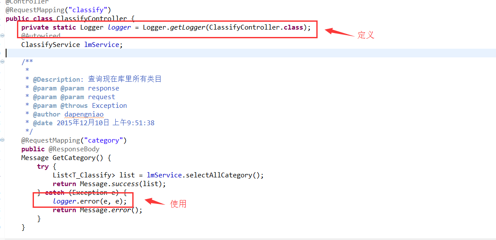

# 微信开发准备(三)--框架以及工具的基本使用

在前面两篇中我们从基本的项目建立到框架搭建，将项目已经搭建成功，并将基本的配置项也都已经配置完成，那么这里我们就进入到对框架的熟悉和一个工具 generator 的使用！

（一）项目部分配置文件的初始化

我们在前面框架中层在 web.xml 文件中配置了一个启动 Servlet 初始化文件，这里做的就是在项目中需要用到某些配置文件的时候，我们在这个时候对配置文件中的值初始化到公共 Properties 中,以方便后面的调用，基本代码实现如下：

```
package com.cuiyongzhi.web.start;
 
import javax.servlet.ServletConfig;
import javax.servlet.ServletException;
import javax.servlet.http.HttpServlet;
 
/**
 * 
 * ClassName: InterfaceUrlIntiServlet
 * 
 * @Description: 項目文件初始化
 * @author dapengniao
 * @date 2015/10/13
 */
public class InterfaceUrlIntiServlet extends HttpServlet {
 
    private static final long serialVersionUID = 1L;
 
    @Override
    public void init(ServletConfig config) throws ServletException {
        InterfaceUrlInti.init();
    }
 
}

```

```
package com.cuiyongzhi.web.start;
 
import java.io.IOException;
import java.io.InputStream;
import java.util.Properties;
 
import com.cuiyongzhi.web.util.GlobalConstants;
 
/**
 * 
 * ClassName: InterfaceUrlInti
 * @Description: 項目啓動配置文件初始化
 * @author dapengniao
 * @date 2015/10/13
 */
public class InterfaceUrlInti {
 
    public synchronized static void init(){
        ClassLoader cl = Thread.currentThread().getContextClassLoader();
        Properties props = new Properties();
        if(GlobalConstants.interfaceUrlProperties==null){
            GlobalConstants.interfaceUrlProperties = new Properties();
        }
        InputStream in = null;
        try {
            in = cl.getResourceAsStream("interface_url.properties");
            props.load(in);
            for(Object key : props.keySet()){
                GlobalConstants.interfaceUrlProperties.put(key, props.get(key));
            }
             
            props = new Properties();
            in = cl.getResourceAsStream("wechat.properties");
            props.load(in);
            for(Object key : props.keySet()){
                GlobalConstants.interfaceUrlProperties.put(key, props.get(key));
            }
             
        } catch (IOException e) {
            e.printStackTrace();
        }finally{
            if(in!=null){
                try {
                    in.close();
                } catch (IOException e) {
                    e.printStackTrace();
                }
            }
        }
        return;
    }
 
}
``` 

在这里我初始化化了两个文件，一个是用来配置在微信开发中经常用的到 appid、AppSecret 的参数（wechat.properties），另外一个用来初始化我们经常用到的 http 请求的 url 地址 interface_url.properties!

初始化成功之后我们只需要通过下面的方法即可在项目中任何想用的地方去使用：GlobalConstants.getInterfaceUrl(key),如下：

```
package com.cuiyongzhi.web.util;
 
import java.util.Properties;
 
public class GlobalConstants {
 
    public static Properties interfaceUrlProperties;
 
/**
 * 
 * @Description: TODO
 * @param @param key
 * @param @return   
 * @author dapengniao
 * @date 2015 年 10 月 13 日 下午 4:59:14
 */
    public static String getInterfaceUrl(String key) {
        return (String) interfaceUrlProperties.get(key);
    }
     
         
     
}
```


（二）对日志文件的配置说明

在我搭建的开发环境中采用的是 log4j 日志记录的方式，这种方式对普通项目是没有问题的，后续将有可能升级为 logback，首先我们在 resources 下新建文件 log4j.properties，简单配置如下：

```
log4j.rootLogger=DEBUG,Console,File
#ERROR,WARN,INFO,DEBUG   日志输出等级依次降低，可以根据自己的需求自己调整输出等级
 
log4j.appender.Console=org.apache.log4j.ConsoleAppender
log4j.appender.Console.Threshold=DEBUG
log4j.appender.Console.Target=System.out
log4j.appender.Console.layout=org.apache.log4j.PatternLayout
log4j.appender.Console.layout.ConversionPattern=[%p][%d{yyyy-MM-dd HH\:mm\:ss,SSS}][%c]%m%n
 
log4j.appender.File=org.apache.log4j.DailyRollingFileAppender 
log4j.appender.File.File=${catalina.base}/wechatlogs/wechat.log
log4j.appender.File.Threshold=INFO
log4j.appender.File.layout=org.apache.log4j.PatternLayout
log4j.appender.File.Append=true
log4j.appender.File.ImmediateFlush=true
log4j.appender.File.DatePattern=yyyy-MM-dd'.log'
log4j.appender.File.layout.ConversionPattern=[%p][%d{yyyy-MM-dd HH\:mm\:ss,SSS}][%c]%m%n
```

有了上面的配置文件之后我们在 web.xml 中加入如下的启动配置即可：
```
<context-param>
    <param-name>log4jConfigLocation</param-name>
    <param-value>classpath:log4j.properties</param-value>
</context-param>
<listener>
    <listener-class>org.springframework.web.util.Log4jConfigListener</listener-class>
</listener>
```
简单的使用如下图所示：



（三）Mybatis 工具 Generator

在这里我要推荐一款工具 Generator，在项目开发中他给我节省了很多，他的作用是让我们能很方便生成我们需要的表对应的 pojo、mapping、dao 的代码，而且使用起来非常简单，由于这篇文章篇幅不短了，所以我开了一篇新的来详细讲解它的使用，地址：http://www.cuiyongzhi.com/?id=36 

感谢你的翻阅，如有疑问可以留言一起讨论额！