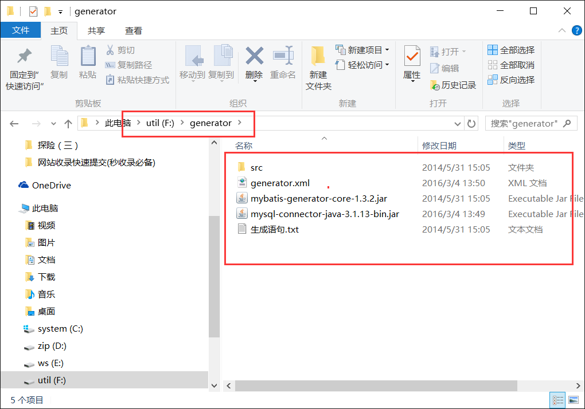
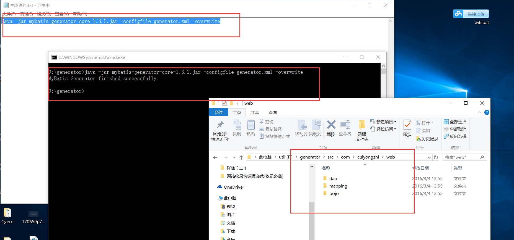

# Mybatis 工具 Generator

MyBatis Generator(以下简称为 MBG)，可以逆向生成持久层的基本代码，而且 mybatis 的实现方案比较好，可以自由组合完成比较复杂的查询，当然更复杂的就需要手动写了，下面整理下基本使用!

1.MBG 的下载

我这里分享的是我经常使用的版本，百度云下载地址：http://pan.baidu.com/s/1dEvCThv 下载成功后的大致目录结构为：



2.打开目录中的 generator.xml 文件，其中部分需要修改的地方我都有备注说明，我这里给出的示例如下：

```
<?xml version="1.0" encoding="UTF-8"?>
<!DOCTYPE generatorConfiguration PUBLIC "-//mybatis.org//DTD MyBatis Generator Configuration 1.0//EN" "http://mybatis.org/dtd/mybatis-generator-config_1_0.dtd">
<generatorConfiguration>
    <!-- 数据库驱动包位置 -->
    <classPathEntry location="F:\generator\mysql.jar" /> 
    <!--<classPathEntry location="C:\oracle\product\10.2.0\db_1\jdbc\lib\ojdbc14.jar" />-->
    <context id="DB2Tables" targetRuntime="MyBatis3">
        <commentGenerator>
            <property name="suppressAllComments" value="true" />
        </commentGenerator>
        <!-- mysql 数据库链接 URL、用户名、密码 -->
         <jdbcConnection driverClass="com.mysql.jdbc.Driver" connectionURL="jdbc:mysql://localhost:3306/wechat" userId="root" password="123456789"> 
        <!--Oracle 数据库使用 -->
        <!--<jdbcConnection driverClass="oracle.jdbc.driver.OracleDriver" connectionURL="jdbc:oracle:thin:@localhost:1521:orcl" userId="msa" password="msa">-->
        </jdbcConnection>
        <javaTypeResolver>
            <property name="forceBigDecimals" value="false" />
        </javaTypeResolver>
        <!-- 生成模型的包名和位置 -->
        <javaModelGenerator targetPackage="com.cuiyongzhi.web.pojo" targetProject="F:\generator\src">
            <property name="enableSubPackages" value="true" />
            <property name="trimStrings" value="true" />
        </javaModelGenerator>
        <!-- 生成的映射文件包名和位置 -->
        <sqlMapGenerator targetPackage="com.cuiyongzhi.web.mapping" targetProject="F:\generator\src">
            <property name="enableSubPackages" value="true" />
        </sqlMapGenerator>
        <!-- 生成 DAO 的包名和位置 -->
        <javaClientGenerator type="XMLMAPPER" targetPackage="com.cuiyongzhi.web.dao" targetProject="F:\generator\src">
            <property name="enableSubPackages" value="true" />
        </javaClientGenerator>
        <!-- 要生成那些表(更改 tableName 和 domainObjectName 就可以) -->
        <table tableName="t_wechatconfig" domainObjectName="WechatConfig" enableCountByExample="false" enableUpdateByExample="false" enableDeleteByExample="false" enableSelectByExample="false" selectByExampleQueryId="false" />
         
    </context>
</generatorConfiguration>
```

这里的 mysql 的依赖包需要定位到自己的 jar 包目录，数据库账号密码、数据库选择、导出的位置、数据库表等设置成自己的即可！

3.生成自己需要的文件的操作只需要到文件目录空白处按住【shift】然后邮件鼠标右击选择【在此处打开命令窗口】，然后复制【生成语句.txt】中的命令道 cmd 命令行，【回车】执行即可，然后我们就可以在【src】里面找到我们设置的目录和文件（下图）！



MBG 的基本使用和注意事项也就是这样了，最后感谢你的翻阅，如有疑问可以留言讨论！