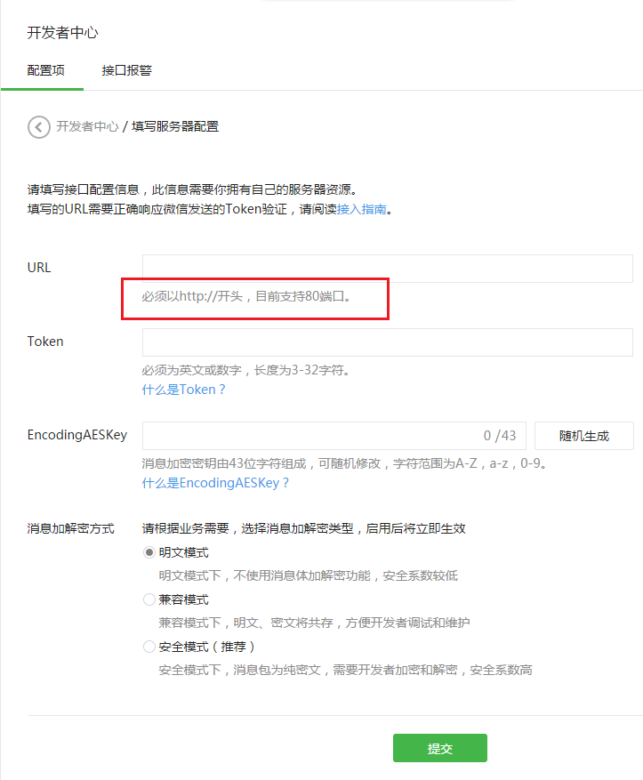
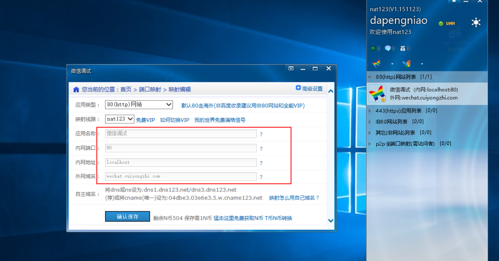
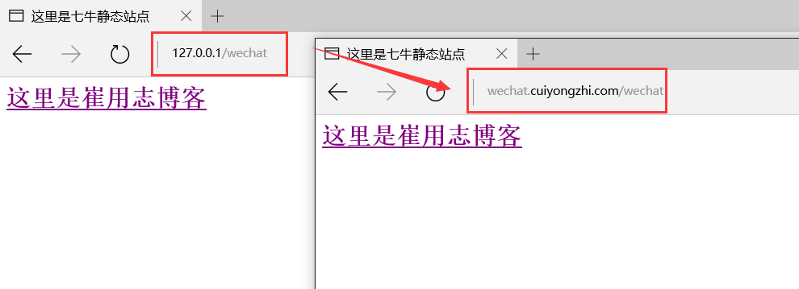

# 微信开发准备(四)--nat123 内网地址公网映射实现

在前面几篇中我们一直说的开发准备工作主要是基于开发框架上的，这里我们说的就逐渐接近开发过程中的实体操作了，如果你之前还没有了解微信平台开发那么你或许是不知道的但是你现在是必须要知道的：**【微信公众平台开发对接必须以 http://或 https://开头，分别支持 80 端口和 443 端口】！**

这里我们就存在一个问题，因为我们平时在开发过程中进本都是在本地开发然后调试，那么我们如何能在本地开发并和微信服务端进行联调呢？由于微信端的端口和网络的限制我们不得不将我们的内网环境映射到公网地址做映射调试，这里我介绍的工具是【nat123】！

（一）nat123 的下载

具体的下载安装参考地址：http://www.nat123.com/Pages_17_291.jsp 

（二）nat123 的 80 端口配置

其中红色框中的配置参数可以自由设置，我这里设置的域名是 wechat.cuiyongzhi.com 对应的是本地 80 端口。

（三）将我们之前配置好的项目启动，可以同时通过 http://127.0.0.1/wechat/ 和 http://wechat.cuiyongzhi.com/wechat/ 同时访问查看结果！

我们可以看到的是一个内网和一个公网地址访问到的具体页面是一直的，这表明我们的内网映射是成功的，感谢你的翻阅，如有疑问可以留言讨论！