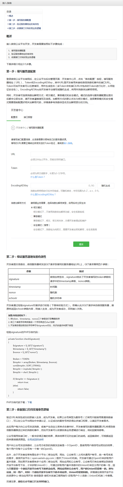
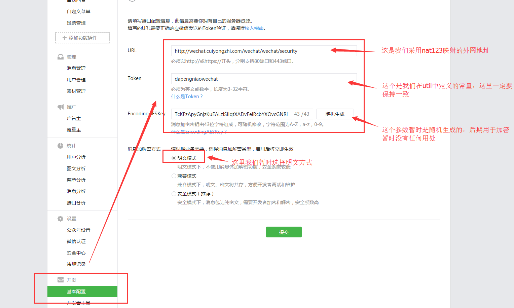
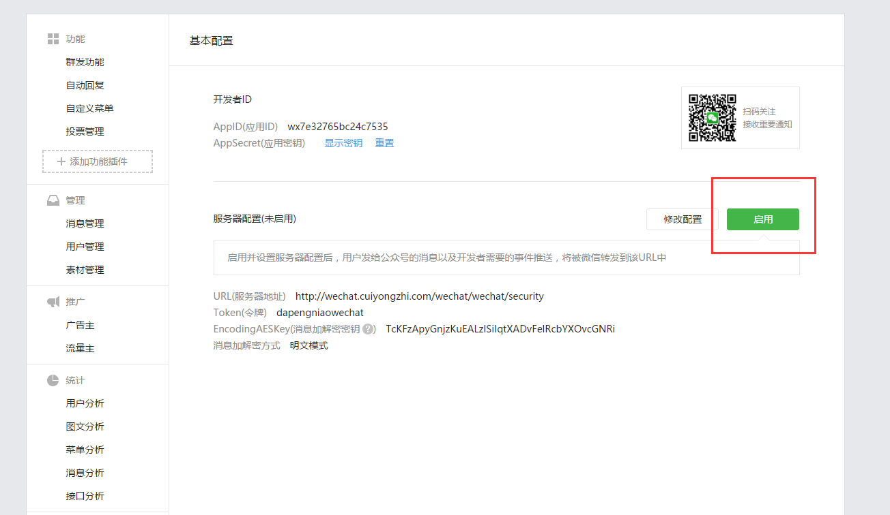

# Java 微信公众平台开发(一)--接入微信公众平台

前面几篇文章一直都在说微信公众平台的开发准备工作，那么从这篇开始我们就将正式的进入 JAVA 微信公众平台开发的整个流程，那么这篇我们开始聊聊如何将我们的服务端和微信公众平台对接！

（一）接入流程解析

在我们的开发过程中无论如何最好的参考工具当然是我们的官方文档了：http://mp.weixin.qq.com/wiki/8/f9a0b8382e0b77d87b3bcc1ce6fbc104.html



**通过上面我们可以看出其中接入微信公众平台开发，开发者需要按照如下步骤完成：**


- 填写服务器配置
- 验证服务器地址的有效性
- 依据接口文档实现业务逻辑
按照上面的逻辑可能是填写服务器配置信息是在第一步，但是我们在真实的开发过程中往往都是先做第二步【编写代码实现验证服务器地址的有效性】，因为没有第二步的完成第一步的配置是不能达到任何效果的！

**（二）验证服务器有效性代码编写**

按照开发文档我们知道我们的应用服务器需要接受微信服务器的 get 请求，其中包含四个参数（signature、timestamp、nonce、echostr）然后通过校验方式校验服务器的可靠性，校验方式如下：

将 token、timestamp、nonce 三个参数进行字典序排序
将三个参数字符串拼接成一个字符串进行 sha1 加密
开发者获得加密后的字符串可与 signature 对比，标识该请求来源于微信
①我在这里写了一个工具类去实现其中的前两步，将三个参数排序并返回 sha1 加密后的字符串，代码如下：
```
package com.cuiyongzhi.wechat.util;
 
import java.security.MessageDigest;  
import java.security.NoSuchAlgorithmException;  
import java.util.Arrays;  
   
/**
 * ClassName: SignUtil
 * @Description: 请求校验工具类 
 * @author dapengniao
 * @date 2016 年 3 月 4 日 下午 6:25:41
 */
public class SignUtil {  
    // 与接口配置信息中的 Token 要一致   
    private static String token = "dapengniaowechat";  
    /** 
     * 验证签名 
     * @param signature 
     * @param timestamp 
     * @param nonce 
     * @return 
     */  
    public static boolean checkSignature(String signature, String timestamp, String nonce) {  
        String[] arr = new String[] { token, timestamp, nonce };  
        // 将 token、timestamp、nonce 三个参数进行字典序排序   
        Arrays.sort(arr);  
        StringBuilder content = new StringBuilder();  
        for (int i = 0; i < arr.length; i++) {  
            content.append(arr[i]);  
        }  
        MessageDigest md = null;  
        String tmpStr = null;  
   
        try {  
            md = MessageDigest.getInstance("SHA-1");  
            // 将三个参数字符串拼接成一个字符串进行 sha1 加密   
            byte[] digest = md.digest(content.toString().getBytes());  
            tmpStr = byteToStr(digest);  
        } catch (NoSuchAlgorithmException e) {  
            e.printStackTrace();  
        }  
   
        content = null;  
        // 将 sha1 加密后的字符串可与 signature 对比，标识该请求来源于微信   
        return tmpStr != null ? tmpStr.equals(signature.toUpperCase()) : false;  
    }  
   
    /** 
     * 将字节数组转换为十六进制字符串 
     * @param byteArray 
     * @return 
     */  
    private static String byteToStr(byte[] byteArray) {  
        String strDigest = "";  
        for (int i = 0; i < byteArray.length; i++) {  
            strDigest += byteToHexStr(byteArray[i]);  
        }  
        return strDigest;  
    }  
   
    /** 
     * 将字节转换为十六进制字符串 
     * @param mByte 
     * @return 
     */  
    private static String byteToHexStr(byte mByte) {  
        char[] Digit = { '0', '1', '2', '3', '4', '5', '6', '7', '8', '9', 'A', 'B', 'C', 'D', 'E', 'F' };  
        char[] tempArr = new char[2];  
        tempArr[0] = Digit[(mByte >>> 4) & 0X0F];  
        tempArr[1] = Digit[mByte & 0X0F];  
        String s = new String(tempArr);  
        return s;  
    }  
}
```
②将我们的工具类应用到我们的服务器验证过程中，这里我新建一个 controller 为 WechatSecurity，实现同一个 get 用于接收参数和返回验证参数，简单代码如下：
```
package com.cuiyongzhi.wechat.controller;
 
import java.io.PrintWriter;
 
import javax.servlet.http.HttpServletRequest;
import javax.servlet.http.HttpServletResponse;
 
import org.apache.log4j.Logger;
import org.springframework.stereotype.Controller;
import org.springframework.web.bind.annotation.RequestMapping;
import org.springframework.web.bind.annotation.RequestMethod;
import org.springframework.web.bind.annotation.RequestParam;
 
import com.cuiyongzhi.wechat.util.SignUtil;
 
@Controller
@RequestMapping("/wechat")
public class WechatSecurity {
    private static Logger logger = Logger.getLogger(WechatSecurity.class);
 
    /**
     * 
     * @Description: 用于接收 get 参数，返回验证参数
     * @param @param request
     * @param @param response
     * @param @param signature
     * @param @param timestamp
     * @param @param nonce
     * @param @param echostr
     * @author dapengniao
     * @date 2016 年 3 月 4 日 下午 6:20:00
     */
    @RequestMapping(value = "security", method = RequestMethod.GET)
    public void doGet(
            HttpServletRequest request,
            HttpServletResponse response,
            @RequestParam(value = "signature", required = true) String signature,
            @RequestParam(value = "timestamp", required = true) String timestamp,
            @RequestParam(value = "nonce", required = true) String nonce,
            @RequestParam(value = "echostr", required = true) String echostr) {
        try {
            if (SignUtil.checkSignature(signature, timestamp, nonce)) {
                PrintWriter out = response.getWriter();
                out.print(echostr);
                out.close();
            } else {
                logger.info("这里存在非法请求！");
            }
        } catch (Exception e) {
            logger.error(e, e);
        }
    }
 
    @RequestMapping(value = "security", method = RequestMethod.POST)
    // post 方法用于接收微信服务端消息
    public void DoPost() {
        System.out.println("这是 post 方法！");
    }
}
```

那么到这里我们的服务器验证的代码就基本完成了，下面我们就进入验证过程！

（三）服务器验证

这里我用来验证的是我的个人公众号【崔用志】，如果大家有兴趣可以搜索看到的，通过微博认证的一个私人号，当然有想法在这里我们也是可以一起交流的，验证方法如下图：




点击【提交】成功之后如下图所示：



点击图中【启用】即可，那么到这里我们的服务器接入配置就完成了，【下一篇我们将讲述如何接收消息并进行消息处理】，感谢你的翻阅，如有疑问可以留言讨论！