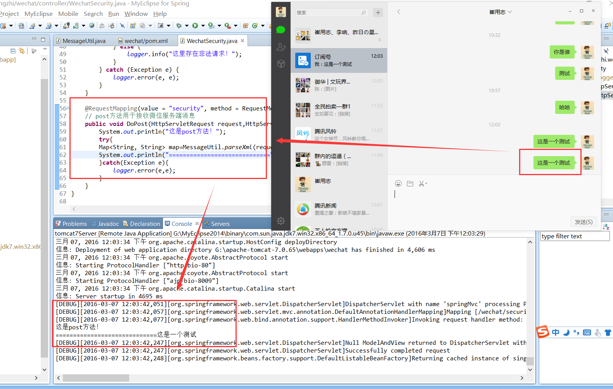

# Java 微信公众平台开发(二)--微信服务器 post 消息体的接收

在上一篇的文章中我们详细讲述了如何将我们的应用服务器和微信腾讯服务器之间的对接操作，最后接入成功，不知道你有没有发现在上一篇的【controller】中我定义了一个 get 方法和一个 post 方法，但是在使用过程中我们就用了 get 方法，这里我们就来说说我们预留的 post 的方法的使用！

**当我们在完成了服务器验证之后，此后用户每次向公众号发送消息、或者产生自定义菜单点击事件时，开发者填写的服务器配置 URL 将得到微信服务器推送过来的消息和事件，然后开发者可以依据自身业务逻辑进行响应，例如回复消息等！** 通过这句话我们能知道后面所有的微信服务器和我们应用服务器之间的沟通都是通过 post 消息体来完成的，那么我们这里将讲述如何接受微信 post 的消息体！

**（一）消息类型和消息格式**

上面有说道我们所有的和微信服务器之间进行沟通基本都是通过 post 消息体完成的，首先我们了解下消息体的类型，大致类型有两种：

普通消息类型：文本消息、图片消息、语音消息、视频消息、小视频消息、地理位置消息、链接消息
事件消息类型：关注/取消关注事件、扫描带参数二维码事件、上报地理位置事件、自定义菜单事件、点击菜单拉取消息时的事件推送、点击菜单跳转链接时的事件推送
消息类型：微信服务端推送的所有消息体的类型格式都是 xml 格式；

**（二）消息重试机制**

微信服务器在五秒内收不到响应会断掉连接，并且重新发起请求，总共重试三次。假如服务器无法保证在五秒内处理并回复，可以直接回复空串，微信服务器不会对此作任何处理，并且不会发起重试，但是这里后期可以使用【客服消息接口】去完成消息再次推送。

**（三）消息接收处理**

在前面我们有说道微信的消息体是采用 xml 格式，那么我在这里写了一个 MessageUtil 去做消息格式的处理，大致代码如下：
```
package com.cuiyongzhi.wechat.util;
import java.io.InputStream;
import java.io.Writer;
import java.util.HashMap;
import java.util.List;
import java.util.Map;
 
import javax.servlet.http.HttpServletRequest;
 
import org.dom4j.Document;
import org.dom4j.Element;
import org.dom4j.io.SAXReader;
 
import com.thoughtworks.xstream.XStream;
import com.thoughtworks.xstream.core.util.QuickWriter;
import com.thoughtworks.xstream.io.HierarchicalStreamWriter;
import com.thoughtworks.xstream.io.xml.PrettyPrintWriter;
import com.thoughtworks.xstream.io.xml.XppDriver;
   
/**
 * ClassName: MessageUtil
 * @Description: 消息工具类
 * @author dapengniao
 * @date 2016 年 3 月 7 日 上午 10:05:04
 */
public class MessageUtil {  
   
    /** 
     * 返回消息类型：文本 
     */  
    public static final String RESP_MESSAGE_TYPE_TEXT = "text";  
   
    /** 
     * 返回消息类型：音乐 
     */  
    public static final String RESP_MESSAGE_TYPE_MUSIC = "music";  
   
    /** 
     * 返回消息类型：图文 
     */  
    public static final String RESP_MESSAGE_TYPE_NEWS = "news";  
   
    /** 
     * 请求消息类型：文本 
     */  
    public static final String REQ_MESSAGE_TYPE_TEXT = "text";  
   
    /** 
     * 请求消息类型：图片 
     */  
    public static final String REQ_MESSAGE_TYPE_IMAGE = "image";  
   
    /** 
     * 请求消息类型：链接 
     */  
    public static final String REQ_MESSAGE_TYPE_LINK = "link";  
   
    /** 
     * 请求消息类型：地理位置 
     */  
    public static final String REQ_MESSAGE_TYPE_LOCATION = "location";  
   
    /** 
     * 请求消息类型：音频 
     */  
    public static final String REQ_MESSAGE_TYPE_VOICE = "voice";  
   
    /** 
     * 请求消息类型：推送 
     */  
    public static final String REQ_MESSAGE_TYPE_EVENT = "event";  
   
    /** 
     * 事件类型：subscribe(订阅) 
     */  
    public static final String EVENT_TYPE_SUBSCRIBE = "subscribe";  
   
    /** 
     * 事件类型：unsubscribe(取消订阅) 
     */  
    public static final String EVENT_TYPE_UNSUBSCRIBE = "unsubscribe";  
   
    /** 
     * 事件类型：CLICK(自定义菜单点击事件) 
     */  
    public static final String EVENT_TYPE_CLICK = "CLICK";  
   
    /**
     * @Description: 解析微信发来的请求（XML） 
     * @param @param request
     * @param @return
     * @param @throws Exception   
     * @author dapengniao
     * @date 2016 年 3 月 7 日 上午 10:04:02
     */
    @SuppressWarnings("unchecked")
    public static Map<String, String> parseXml(HttpServletRequest request) throws Exception {  
        // 将解析结果存储在 HashMap 中   
        Map<String, String> map = new HashMap<String, String>();  
   
        // 从 request 中取得输入流   
        InputStream inputStream = request.getInputStream();  
        // 读取输入流   
        SAXReader reader = new SAXReader();  
        Document document = reader.read(inputStream);  
        // 得到 xml 根元素   
        Element root = document.getRootElement();  
        // 得到根元素的所有子节点   
        List<Element> elementList = root.elements();  
   
        // 遍历所有子节点   
        for (Element e : elementList)  
            map.put(e.getName(), e.getText());  
   
        // 释放资源   
        inputStream.close();  
        inputStream = null;  
   
        return map;  
    }  
   
    @SuppressWarnings("unused")
    private static XStream xstream = new XStream(new XppDriver() {  
        public HierarchicalStreamWriter createWriter(Writer out) {  
            return new PrettyPrintWriter(out) {  
                // 对所有 xml 节点的转换都增加 CDATA 标记   
                boolean cdata = true;  
                @SuppressWarnings("rawtypes")
                public void startNode(String name, Class clazz) {  
                    super.startNode(name, clazz);  
                }  
   
                protected void writeText(QuickWriter writer, String text) {  
                    if (cdata) {  
                        writer.write("<![CDATA[");  
                        writer.write(text);  
                        writer.write("]]>");  
                    } else {  
                        writer.write(text);  
                    }  
                }  
            };  
        }  
    });  
}
```

在这个方法体里需要用到部分依赖，需要在 pom 文件加入如下部分：

```
<!-- xml -->
<dependency>
    <groupId>org.apache.directory.studio</groupId>
    <artifactId>org.dom4j.dom4j</artifactId>
    <version>1.6.1</version>
</dependency>
 
<dependency>
    <groupId>com.thoughtworks.xstream</groupId>
    <artifactId>xstream</artifactId>
    <version>1.4.8</version>
</dependency>

```

然后将我们的 WechatSecurity Controller 中的 post 方法修改为如下，用于做消息的接收和处理：

```
@RequestMapping(value = "security", method = RequestMethod.POST)
    // post 方法用于接收微信服务端消息
    public void DoPost(HttpServletRequest request,HttpServletResponse response) {
        System.out.println("这是 post 方法！");
        try{
        Map<String, String> map=MessageUtil.parseXml(request);
        System.out.println("============================="+map.get("Content"));
        }catch(Exception e){
            logger.error(e,e);
        }
    }
```

因为前面我们已经开启了我们的开发者模式，那么当我们在这里将我们代码发布之后再公众号上发送消息，在们的后台就能看到我们的消息体进入并解析成功了，这里我输出的是微信的【原始 ID】,截图大致如下：



在这里我只是做了消息体的接收和转换成 Map,并没有对消息做出来，那么下一篇我们将讲述对消息的分类处理！感谢你的翻阅，如有疑问可以留言讨论！