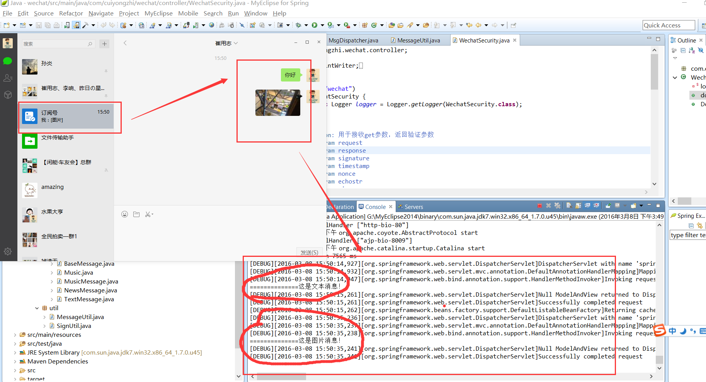
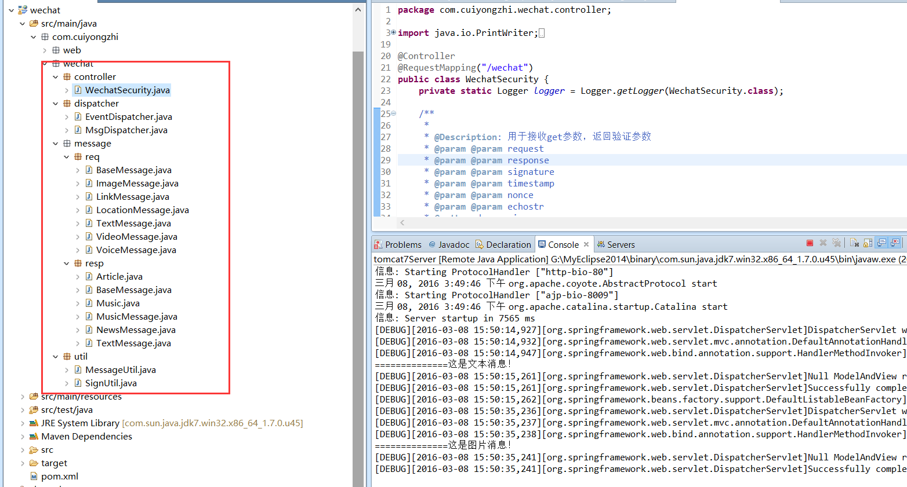

# Java 微信公众平台开发(三)--接收消息的分类及实体的创建

前面一篇有说道应用服务器和腾讯服务器是通过消息进行通讯的，并简单介绍了微信端 post 的消息类型，这里我们将建立消息实体以方便我们后面的使用！

（一）消息实体基础类

```
package com.cuiyongzhi.wechat.message.req;
 
/**
 * ClassName: BaseMessage
 * @Description: 微信请求消息基本类
 * @author dapengniao
 * @date 2016 年 3 月 7 日 下午 3:03:59
 */
public class BaseMessage {
    // 开发者微信号
    private String ToUserName;
    // 发送方帐号（一个 OpenID）
    private String FromUserName;
    // 消息创建时间 （整型）
    private long CreateTime;
    // 消息类型（text/image/location/link/video/shortvideo）
    private String MsgType;
    // 消息 id，64 位整型
    private long MsgId;
 
    public String getToUserName() {
        return ToUserName;
    }
 
    public void setToUserName(String toUserName) {
        ToUserName = toUserName;
    }
 
    public String getFromUserName() {
        return FromUserName;
    }
 
    public void setFromUserName(String fromUserName) {
        FromUserName = fromUserName;
    }
 
    public long getCreateTime() {
        return CreateTime;
    }
 
    public void setCreateTime(long createTime) {
        CreateTime = createTime;
    }
 
    public String getMsgType() {
        return MsgType;
    }
 
    public void setMsgType(String msgType) {
        MsgType = msgType;
    }
 
    public long getMsgId() {
        return MsgId;
    }
 
    public void setMsgId(long msgId) {
        MsgId = msgId;
    }
}
```

（二）普通消息 pojo 实体

1.图片消息

```
package com.cuiyongzhi.wechat.message.req;
 
/**
 * ClassName: ImageMessage
 * @Description: 图片消息
 * @author dapengniao
 * @date 2016 年 3 月 7 日 下午 3:04:52
 */
public class ImageMessage extends BaseMessage {
    // 图片链接
    private String PicUrl;
 
    public String getPicUrl() {
        return PicUrl;
    }
 
    public void setPicUrl(String picUrl) {
        PicUrl = picUrl;
    }
}
```

2.连接消息

```
package com.cuiyongzhi.wechat.message.req;
 
/**
 * ClassName: LinkMessage
 * @Description: 连接消息
 * @author dapengniao
 * @date 2016 年 3 月 7 日 下午 3:05:48
 */
public class LinkMessage extends BaseMessage {
    // 消息标题
    private String Title;
    // 消息描述
    private String Description;
    // 消息链接
    private String Url;
 
    public String getTitle() {
        return Title;
    }
 
    public void setTitle(String title) {
        Title = title;
    }
 
    public String getDescription() {
        return Description;
    }
 
    public void setDescription(String description) {
        Description = description;
    }
 
    public String getUrl() {
        return Url;
    }
 
    public void setUrl(String url) {
        Url = url;
    }
}
```

3.地理位置消息

```
package com.cuiyongzhi.wechat.message.req;
 
/**
 * ClassName: LocationMessage
 * @Description: 地理位置消息
 * @author dapengniao
 * @date 2016 年 3 月 7 日 下午 3:06:10
 */
public class LocationMessage extends BaseMessage {  
    // 地理位置维度   
    private String Location_X;  
    // 地理位置经度   
    private String Location_Y;  
    // 地图缩放大小   
    private String Scale;  
    // 地理位置信息   
    private String Label;  
   
    public String getLocation_X() {  
        return Location_X;  
    }  
   
    public void setLocation_X(String location_X) {  
        Location_X = location_X;  
    }  
   
    public String getLocation_Y() {  
        return Location_Y;  
    }  
   
    public void setLocation_Y(String location_Y) {  
        Location_Y = location_Y;  
    }  
   
    public String getScale() {  
        return Scale;  
    }  
   
    public void setScale(String scale) {  
        Scale = scale;  
    }  
   
    public String getLabel() {  
        return Label;  
    }  
   
    public void setLabel(String label) {  
        Label = label;  
    }  
}
```

4.文本消息

```
package com.cuiyongzhi.wechat.message.req;
 
/**
 * ClassName: TextMessage
 * @Description: 文本消息
 * @author dapengniao
 * @date 2016 年 3 月 7 日 下午 3:06:40
 */
public class TextMessage extends BaseMessage {  
    // 消息内容   
    private String Content;  
   
    public String getContent() {  
        return Content;  
    }  
   
    public void setContent(String content) {  
        Content = content;  
    }  
}
```

5.视频/小视屏消息

```
package com.cuiyongzhi.wechat.message.req;
 
/**
 * ClassName: VideoMessage
 * @Description: 视频/小视屏消息
 * @author dapengniao
 * @date 2016 年 3 月 7 日 下午 3:12:51
 */
public class VideoMessage extends BaseMessage {
 
    private String MediaId; // 视频消息媒体 id，可以调用多媒体文件下载接口拉取数据
    private String ThumbMediaId; // 视频消息缩略图的媒体 id，可以调用多媒体文件下载接口拉取数据
 
    public String getMediaId() {
        return MediaId;
    }
 
    public void setMediaId(String mediaId) {
        MediaId = mediaId;
    }
 
    public String getThumbMediaId() {
        return ThumbMediaId;
    }
 
    public void setThumbMediaId(String thumbMediaId) {
        ThumbMediaId = thumbMediaId;
    }
 
}
```

6.语音消息

```
package com.cuiyongzhi.wechat.message.req;
 
/**
 * ClassName: VoiceMessage
 * @Description: 语音消息
 * @author dapengniao
 * @date 2016 年 3 月 7 日 下午 3:07:10
 */
public class VoiceMessage extends BaseMessage {  
    // 媒体 ID   
    private String MediaId;  
    // 语音格式   
    private String Format;  
   
    public String getMediaId() {  
        return MediaId;  
    }  
   
    public void setMediaId(String mediaId) {  
        MediaId = mediaId;  
    }  
   
    public String getFormat() {  
        return Format;  
    }  
   
    public void setFormat(String format) {  
        Format = format;  
    }  
}
```

（三）消息分类处理

按照上面收到想消息类别分别做不同的分发处理，这里我们建立了自己的业务分发器（EventDispatcher、MsgDispatcher），分别做普通消息处理和事件消息处理！

1.MsgDispatcher.java——用于普通消息的业务分发处理

```
package com.cuiyongzhi.wechat.dispatcher;
 
import java.util.Map;
 
import com.cuiyongzhi.wechat.util.MessageUtil;
 
/**
 * ClassName: MsgDispatcher
 * @Description: 消息业务处理分发器
 * @author dapengniao
 * @date 2016 年 3 月 7 日 下午 4:04:21
 */
public class MsgDispatcher {
    public static String processMessage(Map<String, String> map) {
        if (map.get("MsgType").equals(MessageUtil.REQ_MESSAGE_TYPE_TEXT)) { // 文本消息
            System.out.println("==============这是文本消息！");
        }
         
        if (map.get("MsgType").equals(MessageUtil.REQ_MESSAGE_TYPE_IMAGE)) { // 图片消息
            System.out.println("==============这是图片消息！");
        }
         
         
        if (map.get("MsgType").equals(MessageUtil.REQ_MESSAGE_TYPE_LINK)) { // 链接消息
            System.out.println("==============这是链接消息！");
        }
         
         
        if (map.get("MsgType").equals(MessageUtil.REQ_MESSAGE_TYPE_LOCATION)) { // 位置消息
            System.out.println("==============这是位置消息！");
        }
         
         
        if (map.get("MsgType").equals(MessageUtil.REQ_MESSAGE_TYPE_VIDEO)) { // 视频消息
            System.out.println("==============这是视频消息！");
        }
         
         
        if (map.get("MsgType").equals(MessageUtil.REQ_MESSAGE_TYPE_VOICE)) { // 语音消息
            System.out.println("==============这是语音消息！");
        }
 
        return null;
    }
}
```

2.EventDispatcher.java——事件消息的业务分发处理
```
package com.cuiyongzhi.wechat.dispatcher;
 
import java.util.Map;
 
import com.cuiyongzhi.wechat.util.MessageUtil;
 
/**
 * ClassName: EventDispatcher
 * @Description: 事件消息业务分发器
 * @author dapengniao
 * @date 2016 年 3 月 7 日 下午 4:04:41
 */
public class EventDispatcher {
    public static String processEvent(Map<String, String> map) {
        if (map.get("Event").equals(MessageUtil.EVENT_TYPE_SUBSCRIBE)) { //关注事件
            System.out.println("==============这是关注事件！");
        }
         
        if (map.get("Event").equals(MessageUtil.EVENT_TYPE_UNSUBSCRIBE)) { //取消关注事件
            System.out.println("==============这是取消关注事件！");
        }
         
        if (map.get("Event").equals(MessageUtil.EVENT_TYPE_SCAN)) { //扫描二维码事件
            System.out.println("==============这是扫描二维码事件！");
        }
         
        if (map.get("Event").equals(MessageUtil.EVENT_TYPE_LOCATION)) { //位置上报事件
            System.out.println("==============这是位置上报事件！");
        }
         
        if (map.get("Event").equals(MessageUtil.EVENT_TYPE_CLICK)) { //自定义菜单点击事件
            System.out.println("==============这是自定义菜单点击事件！");
        }
         
        if (map.get("Event").equals(MessageUtil.EVENT_TYPE_VIEW)) { //自定义菜单 View 事件
            System.out.println("==============这是自定义菜单 View 事件！");
        }
         
         
        return null;
    }
}
```

这个时候我们需要把我们的消息入口【WechatSecurity.java】中的 post 方法做些修改，最终结果如下：
```
package com.cuiyongzhi.wechat.controller;
 
import java.io.PrintWriter;
import java.util.Map;
 
import javax.servlet.http.HttpServletRequest;
import javax.servlet.http.HttpServletResponse;
 
import org.apache.log4j.Logger;
import org.springframework.stereotype.Controller;
import org.springframework.web.bind.annotation.RequestMapping;
import org.springframework.web.bind.annotation.RequestMethod;
import org.springframework.web.bind.annotation.RequestParam;
 
import com.cuiyongzhi.wechat.dispatcher.EventDispatcher;
import com.cuiyongzhi.wechat.dispatcher.MsgDispatcher;
import com.cuiyongzhi.wechat.util.MessageUtil;
import com.cuiyongzhi.wechat.util.SignUtil;
 
@Controller
@RequestMapping("/wechat")
public class WechatSecurity {
    private static Logger logger = Logger.getLogger(WechatSecurity.class);
 
    /**
     * 
     * @Description: 用于接收 get 参数，返回验证参数
     * @param @param request
     * @param @param response
     * @param @param signature
     * @param @param timestamp
     * @param @param nonce
     * @param @param echostr
     * @author dapengniao
     * @date 2016 年 3 月 4 日 下午 6:20:00
     */
    @RequestMapping(value = "security", method = RequestMethod.GET)
    public void doGet(
            HttpServletRequest request,
            HttpServletResponse response,
            @RequestParam(value = "signature", required = true) String signature,
            @RequestParam(value = "timestamp", required = true) String timestamp,
            @RequestParam(value = "nonce", required = true) String nonce,
            @RequestParam(value = "echostr", required = true) String echostr) {
        try {
            if (SignUtil.checkSignature(signature, timestamp, nonce)) {
                PrintWriter out = response.getWriter();
                out.print(echostr);
                out.close();
            } else {
                logger.info("这里存在非法请求！");
            }
        } catch (Exception e) {
            logger.error(e, e);
        }
    }
 
    /**
     * @Description: 接收微信端消息处理并做分发
     * @param @param request
     * @param @param response   
     * @author dapengniao
     * @date 2016 年 3 月 7 日 下午 4:06:47
     */
    @RequestMapping(value = "security", method = RequestMethod.POST)
    public void DoPost(HttpServletRequest request,HttpServletResponse response) {
        try{
            Map<String, String> map=MessageUtil.parseXml(request);
            String msgtype=map.get("MsgType");
            if(MessageUtil.REQ_MESSAGE_TYPE_EVENT.equals(msgtype)){
                EventDispatcher.processEvent(map); //进入事件处理
            }else{
                MsgDispatcher.processMessage(map); //进入消息处理
            }
        }catch(Exception e){
            logger.error(e,e);
        }
    }
}

```

最后我们运行成功项目之后我们可以通过发送不同类型的消息来验证我们的消息分类的正确性，如下图所示：



新建了这么多文件，最后来看下我们的整个项目的目录结构：



前面讲述的都是消息的接收，那么下一篇起将讲述【回复消息的分类及实体的创建】，感谢你的翻阅，如有疑问可以留言一起讨论！