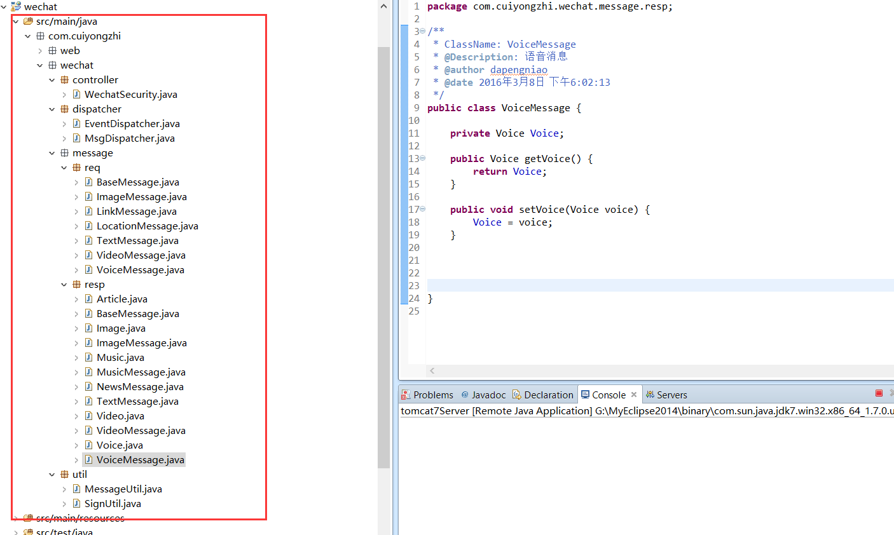

# Java 微信公众平台开发(四)--回复消息的分类及实体的创建

前面有说道对接收到微信服务器消息后对消息的分类，当时主要分为普通消息和事件消息，这里我们要讲述的是我们在给用户回复的消息类型，在这里也可以大致分为两类：一种为不需要上传资源到微信服务器的这里成为【普通消息回复】；还有一种需要上传资源到微信服务器的这里称为【多媒体消息回复】！

- 普通消息回复：回复文本消息/回复图文消息
- 多媒体消息回复：回复图片消息/回复语音消息/回复视频消息/回复音乐消息

（一）回复消息基类的实现

```
package com.cuiyongzhi.wechat.message.resp;
 
/**
 * ClassName: BaseMessage
 * @Description: 返回消息体-基本消息
 * @author dapengniao
 * @date 2016 年 3 月 7 日 下午 3:16:57
 */
public class BaseMessage {  
    // 接收方帐号（收到的 OpenID）   
    private String ToUserName;  
    // 开发者微信号   
    private String FromUserName;  
    // 消息创建时间 （整型）   
    private long CreateTime;  
    // 消息类型（text/music/news）   
    private String MsgType;  
      
   
    public String getToUserName() {  
        return ToUserName;  
    }  
   
    public void setToUserName(String toUserName) {  
        ToUserName = toUserName;  
    }  
   
    public String getFromUserName() {  
        return FromUserName;  
    }  
   
    public void setFromUserName(String fromUserName) {  
        FromUserName = fromUserName;  
    }  
   
    public long getCreateTime() {  
        return CreateTime;  
    }  
   
    public void setCreateTime(long createTime) {  
        CreateTime = createTime;  
    }  
   
    public String getMsgType() {  
        return MsgType;  
    }  
   
    public void setMsgType(String msgType) {  
        MsgType = msgType;  
    }  
   
   
}
```
（二）普通消息回复实体实现

1.文本消息消息体

```
package com.cuiyongzhi.wechat.message.resp;
 
/**
 * ClassName: TextMessage
 * @Description: 文本消息消息体
 * @author dapengniao
 * @date 2016 年 3 月 7 日 下午 3:54:22
 */
public class TextMessage extends BaseMessage {  
    // 回复的消息内容   
    private String Content;  
   
    public String getContent() {  
        return Content;  
    }  
   
    public void setContent(String content) {  
        Content = content;  
    }  
}
```

2.图文/多图文消息实现

```
package com.cuiyongzhi.wechat.message.resp;
 
/**
 * ClassName: Article
 * @Description: 图文消息体
 * @author dapengniao
 * @date 2016 年 3 月 7 日 下午 3:16:28
 */
public class Article {  
    // 图文消息名称   
    private String Title;  
    // 图文消息描述   
    private String Description;  
    // 图片链接，支持 JPG、PNG 格式，较好的效果为大图 640*320，小图 80*80，
    private String PicUrl;  
    // 点击图文消息跳转链接   
    private String Url;  
   
    public String getTitle() {  
        return Title;  
    }  
   
    public void setTitle(String title) {  
        Title = title;  
    }  
   
    public String getDescription() {  
        return null == Description ? "" : Description;  
    }  
   
    public void setDescription(String description) {  
        Description = description;  
    }  
   
    public String getPicUrl() {  
        return null == PicUrl ? "" : PicUrl;  
    }  
   
    public void setPicUrl(String picUrl) {  
        PicUrl = picUrl;  
    }  
   
    public String getUrl() {  
        return null == Url ? "" : Url;  
    }  
   
    public void setUrl(String url) {  
        Url = url;  
    }  
   
}
```
```
package com.cuiyongzhi.wechat.message.resp;
 
import java.util.List;
 
/**
 * ClassName: NewsMessage
 * @Description: 多图文消息
 * @author dapengniao
 * @date 2016 年 3 月 7 日 下午 3:52:18
 */
public class NewsMessage extends BaseMessage {  
    // 图文消息个数，限制为 10 条以内   
    private int ArticleCount;  
    // 多条图文消息信息，默认第一个 item 为大图   
    private List<Article> Articles;  
   
    public int getArticleCount() {  
        return ArticleCount;  
    }  
   
    public void setArticleCount(int articleCount) {  
        ArticleCount = articleCount;  
    }  
   
    public List<Article> getArticles() {  
        return Articles;  
    }  
   
    public void setArticles(List<Article> articles) {  
        Articles = articles;  
    }  
}
```
（三）多媒体消息回复消息体实现

1.回复图片消息实体

```
package com.cuiyongzhi.wechat.message.resp;
 
/**
 * ClassName: Image
 * @Description: 图片回复消息体
 * @author dapengniao
 * @date 2016 年 3 月 8 日 下午 5:55:18
 */
public class Image {
 
    private String MediaId;
 
    public String getMediaId() {
        return MediaId;
    }
 
    public void setMediaId(String mediaId) {
        MediaId = mediaId;
    }
     
}
```
```
package com.cuiyongzhi.wechat.message.resp;
 
/**
 * ClassName: ImageMessage
 * @Description: 图片消息
 * @author dapengniao
 * @date 2016 年 3 月 8 日 下午 5:58:10
 */
public class ImageMessage {
     
    private Image Image;
 
    public Image getImage() {
        return Image;
    }
 
    public void setImage(Image image) {
        Image = image;
    }
     
 
}
```
2.回复音乐消息实体

```
package com.cuiyongzhi.wechat.message.resp;
 
/**
 * ClassName: Music
 * @Description: 音乐消息消息体
 * @author dapengniao
 * @date 2016 年 3 月 7 日 下午 3:54:00
 */
public class Music {  
    // 音乐名称   
    private String Title;  
    // 音乐描述   
    private String Description;  
    // 音乐链接   
    private String MusicUrl;  
    // 高质量音乐链接，WIFI 环境优先使用该链接播放音乐   
    private String HQMusicUrl;
     
    private String ThumbMediaId; //缩略图的媒体 id
   
    public String getThumbMediaId() {
        return ThumbMediaId;
    }
 
    public void setThumbMediaId(String thumbMediaId) {
        ThumbMediaId = thumbMediaId;
    }
 
    public String getTitle() {  
        return Title;  
    }  
   
    public void setTitle(String title) {  
        Title = title;  
    }  
   
    public String getDescription() {  
        return Description;  
    }  
   
    public void setDescription(String description) {  
        Description = description;  
    }  
   
    public String getMusicUrl() {  
        return MusicUrl;  
    }  
   
    public void setMusicUrl(String musicUrl) {  
        MusicUrl = musicUrl;  
    }  
   
    public String getHQMusicUrl() {  
        return HQMusicUrl;  
    }  
   
    public void setHQMusicUrl(String musicUrl) {  
        HQMusicUrl = musicUrl;  
    }  
   
}
```

```
package com.cuiyongzhi.wechat.message.resp;
 
/**
 * ClassName: MusicMessage
 * @Description: 音乐消息
 * @author dapengniao
 * @date 2016 年 3 月 7 日 下午 3:53:38
 */
public class MusicMessage extends BaseMessage {  
    // 音乐   
    private Music Music;  
   
    public Music getMusic() {  
        return Music;  
    }  
   
    public void setMusic(Music music) {  
        Music = music;  
    }  
}
```

3.回复视频消息实体

```
package com.cuiyongzhi.wechat.message.resp;
 
/**
 * ClassName: Video
 * @Description: 视频消息体
 * @author dapengniao
 * @date 2016 年 3 月 8 日 下午 6:05:45
 */
public class Video {
 
    private String MediaId;
    private String Title;
    private String Description;
 
    public String getTitle() {
        return Title;
    }
 
    public void setTitle(String title) {
        Title = title;
    }
 
    public String getDescription() {
        return Description;
    }
 
    public void setDescription(String description) {
        Description = description;
    }
 
    public String getMediaId() {
        return MediaId;
    }
 
    public void setMediaId(String mediaId) {
        MediaId = mediaId;
    }
 
}
```

```
package com.cuiyongzhi.wechat.message.resp;
 
/**
 * ClassName: VideoMessage
 * @Description: 视频消息
 * @author dapengniao
 * @date 2016 年 3 月 8 日 下午 6:06:29
 */
public class VideoMessage {
     
    private Video Video;
 
    public Video getVideo() {
        return Video;
    }
 
    public void setVideo(Video video) {
        Video = video;
    }
 
 
}
```
4.回复语音消息实体

```
package com.cuiyongzhi.wechat.message.resp;
 
/**
 * ClassName: Voice
 * @Description: 语音消息体
 * @author dapengniao
 * @date 2016 年 3 月 8 日 下午 6:02:29
 */
public class Voice {
 
    private String MediaId;
     
    public String getMediaId() {
        return MediaId;
    }
 
    public void setMediaId(String mediaId) {
        MediaId = mediaId;
    }
     
}
```
```
package com.cuiyongzhi.wechat.message.resp;
 
/**
 * ClassName: VoiceMessage
 * @Description: 语音消息
 * @author dapengniao
 * @date 2016 年 3 月 8 日 下午 6:02:13
 */
public class VoiceMessage {
     
    private Voice Voice;
 
    public Voice getVoice() {
        return Voice;
    }
 
    public void setVoice(Voice voice) {
        Voice = voice;
    }
 
 
     
 
}
```
那么到这里回复消息类型的划分和实体的具体实现代码就基本编写完成了，在这些新增实体加入后我们项目的项目结构大致如下:



下篇将讲述【普通消息体的回复】实现，感谢你的翻阅，如有疑问可以留言讨论！